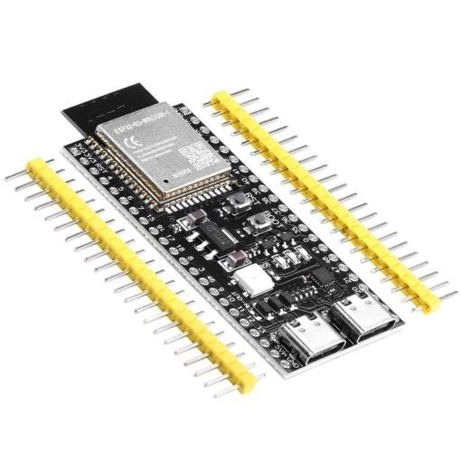
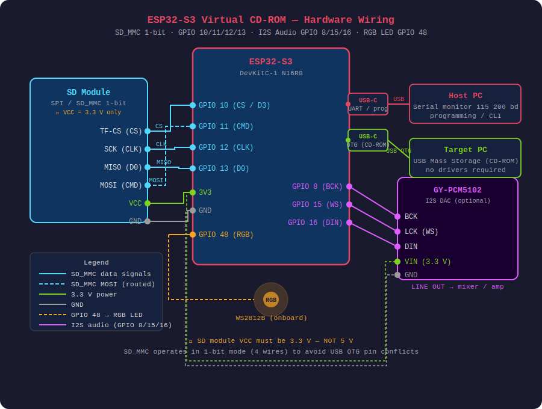
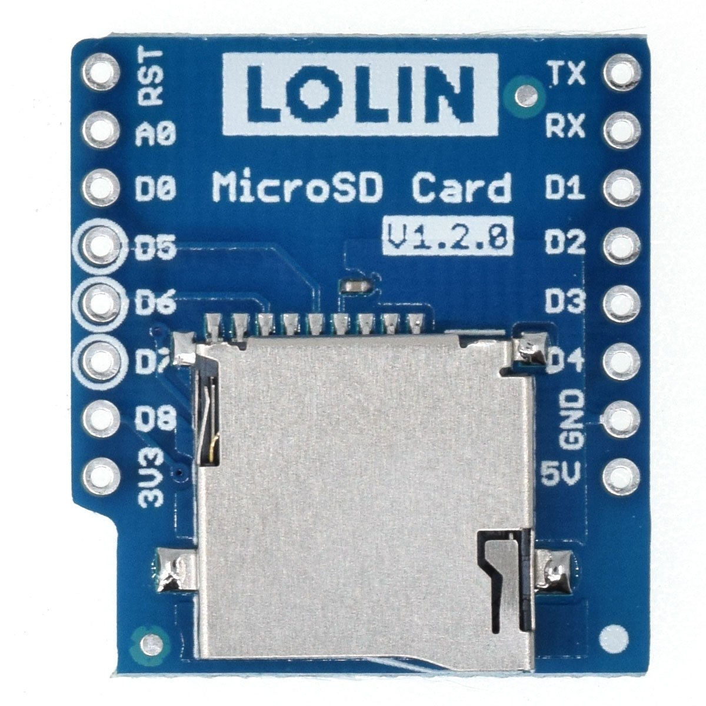
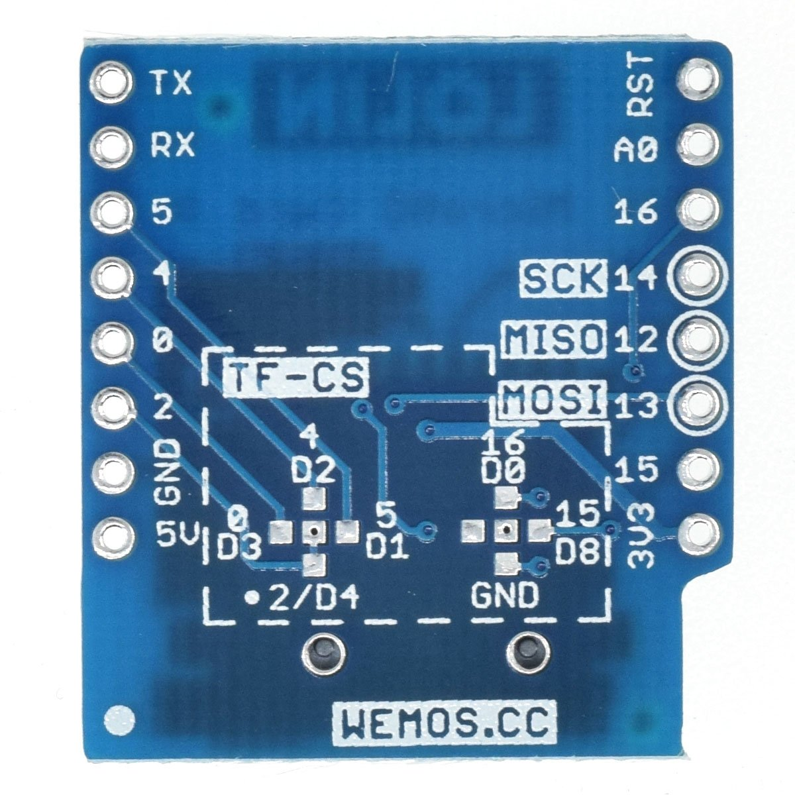
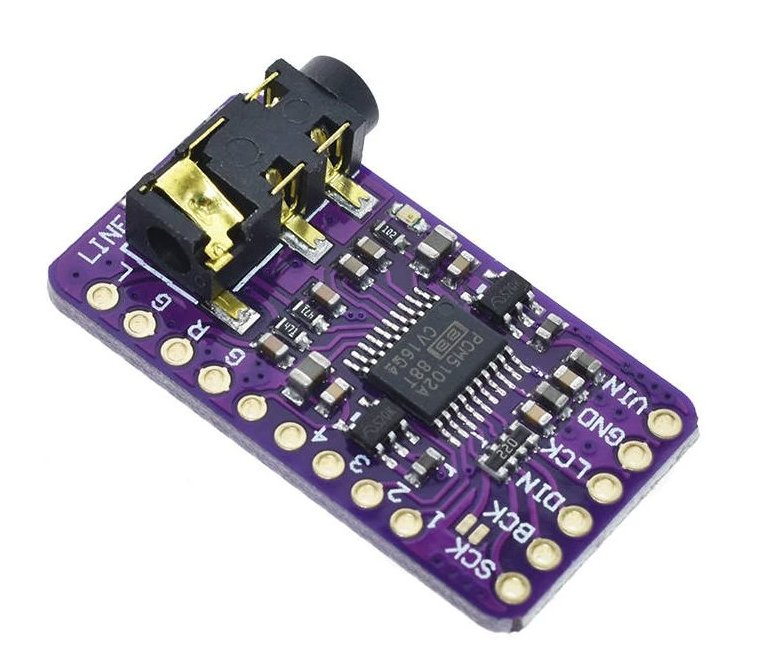
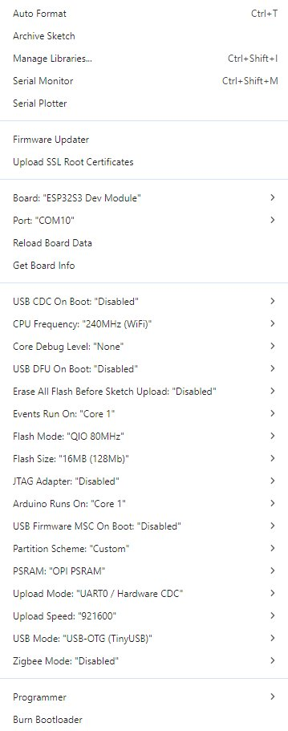

# ESP32-S3 Virtual CD-ROM + GoTek Floppy Emulator

Firmware for the ESP32-S3 that emulates a **USB CD-ROM drive** and optionally a **USB floppy drive source for GoTek hardware**. Disc and floppy images are stored on an SD card and presented to the host PC or GoTek device via USB. Works natively on Windows and Linux without any drivers. For DOS and retro systems a modified `USBCD.SYS`-based driver (`ESPUSBCD.SYS`) is included, providing full data and audio CD support. The device also acts as a Wi-Fi file manager and supports audio track playback from CUE images via an I2S DAC module.

---

## Two Firmware Variants

This project provides two firmware builds. Both use the same hardware, wiring and Arduino IDE settings.

### GoTek/ESP32S3_VirtualCDROM.ino

The primary build. Contains the complete CD-ROM firmware plus GoTek floppy emulation. The active mode — CD-ROM or GoTek — is switchable from the web interface or serial CLI without reflashing.

```
GoTek/
├── ESP32S3_VirtualCDROM.ino  ← primary firmware
├── html_page.h
├── partitions.csv
├── build_exfat_libs.py
└── build/
    ├── firmware_merged.bin
    ├── flash_windows.bat
    └── flash_linux.sh
```

In CD-ROM mode the device enumerates with USB PID `0x1001` and SCSI type `0x05` — Windows installs the CdRom driver. In GoTek mode it enumerates with PID `0x8020` and SCSI type `0x00` — Windows installs the Disk driver and GoTek hardware can read floppy images from the ESP32 via raw LBA access.

### ESP32S3_VirtualCDROM.ino

CD-ROM emulation only. Kept for reference and minimal deployments where GoTek support is not needed. All features documented in this file apply to this build as well, with the exception of everything in the GoTek section.

```
ESP32S3_VirtualCDROM.ino
html_page.h
partitions.csv
build_exfat_libs.py
build/
├── firmware_merged.bin
├── flash_windows.bat
└── flash_linux.sh
```

The `build_exfat_libs.py` patch script must be run before compiling either build.

---

## Table of Contents

- [Two Firmware Variants](#two-firmware-variants)
- [Features](#features)
- [Hardware Requirements](#hardware-requirements)
- [Wiring](#wiring)
- [Complete Setup from Scratch](#complete-setup-from-scratch)
  - [1. Install Arduino IDE](#1-install-arduino-ide)
  - [2. Install ESP32 Board Package](#2-install-esp32-board-package)
  - [3. Install Libraries](#3-install-libraries)
  - [4. Arduino IDE Settings](#4-arduino-ide-settings)
  - [5. Install WSL with AlmaLinux](#5-install-wsl-with-almalinux)
  - [6. Install Tools in AlmaLinux](#6-install-tools-in-almalinux)
  - [7. Run build_exfat_libs.py](#7-run-build_exfat_libspy)
  - [8. Compile and Upload Firmware](#8-compile-and-upload-firmware)
  - [9. First Boot and Configuration](#9-first-boot-and-configuration)
- [Arduino IDE Settings Reference](#arduino-ide-settings-reference)
- [Web Interface](#web-interface)
- [Serial CLI](#serial-cli)
- [Wi-Fi Configuration](#wi-fi-configuration)
- [802.1x Enterprise Wi-Fi (EAP)](#8021x-enterprise-wi-fi-eap)
- [DOS Compatibility Mode](#dos-compatibility-mode)
- [DOS / Retro PC Compatibility](#dos--retro-pc-compatibility)
  - [DOS Audio CD Player Compatibility](#dos-audio-cd-player-compatibility)
- [Web UI Authentication](#web-ui-authentication)
- [HTTPS / TLS](#https--tls)
- [Audio CD Playback](#audio-cd-playback)
- [SCSI Command Reference](#scsi-command-reference)
- [Supported Disc Image Formats](#supported-disc-image-formats)
- [Python Scripts](#python-scripts)
- [API Reference](#api-reference)
- [RGB LED Status Codes](#rgb-led-status-codes)
- [Troubleshooting](#troubleshooting)
- [Building and Flashing Without Arduino IDE](#building-and-flashing-without-arduino-ide)
- [Project Files](#project-files)
- [GoTek Floppy Emulator Extension](#gotek-floppy-emulator-extension)
  - [Overview](#overview)
  - [GoTek Hardware and Firmware Compatibility](#gotek-hardware-and-firmware-compatibility)
  - [USB Presentation Modes](#usb-presentation-modes)
  - [FAT32 Write-Protect Mode](#fat32-write-protect-mode)
  - [Project Structure](#project-structure-1)
  - [GoTek Features](#gotek-features)
  - [Files in this Folder](#files-in-this-folder)
  - [Setup and Compilation](#setup-and-compilation)
  - [Switching Between CD-ROM and GoTek Mode](#switching-between-cd-rom-and-gotek-mode)
  - [Preparing the SD Card for GoTek Mode](#preparing-the-sd-card-for-gotek-mode)
  - [GoTek Web Interface](#gotek-web-interface)
  - [Slot Ordering and Image Names](#slot-ordering-and-image-names)
  - [Catalog JSON Generator](#catalog-json-generator)
  - [Image Editor](#image-editor)
  - [Debug and Diagnostics](#debug-and-diagnostics)
  - [GoTek API Reference](#gotek-api-reference)
  - [USB Classification Fix](#usb-classification-fix)
  - [Technical Notes — How GoTek Raw Mode Works](#technical-notes--how-gotek-raw-mode-works)
  - [Troubleshooting GoTek Mode](#troubleshooting-gotek-mode)

---

## Features

> Features below apply to **both firmware variants**. GoTek-specific features are listed in the [GoTek Floppy Emulator Extension](#gotek-floppy-emulator-extension) section.

- **USB CD-ROM emulation** — USB MSC with CD-ROM SCSI profile; seen as optical drive on any OS without drivers
- **Disc image formats** — ISO 9660 (`.iso`), raw binary (`.bin`), CUE sheets (`.cue`) with full multi-track support and all raw sector formats
- **Audio CD playback** — via GY-PCM5102 I2S DAC; full SCSI-2 audio command set (PLAY AUDIO, READ TOC, READ SUB-CHANNEL, PAUSE/RESUME, STOP); clean output on DOS PCs; HTML player for any OS
- **Win98 Stop/Pause detection** — detects Win98 CDPlayer Stop/Pause via READ_SUB_CHANNEL polling absence; configurable timeout
- **CUE parser** — all sector formats, physical/virtual pregap, single-BIN and per-track-BIN layouts
- **Web file manager** — upload, download, delete, folders, drag-and-drop
- **Wi-Fi** — WPA2-Personal, WPA2-Enterprise PEAP, WPA2-Enterprise EAP-TLS with certificate management
- **mDNS** — device reachable at `hostname.local`
- **NVS persistence** — all settings survive reboot
- **Serial CLI** — complete configuration and diagnostics at 115 200 baud
- **PSRAM read-ahead sector cache** — 2-window LRU cache in PSRAM, 128 sectors per window (512 KB total); eliminates SD seek overhead for disc reads and handles simultaneous directory/data access patterns without cache thrash
- **exFAT SD cards** — supported after applying the `build_exfat_libs.py` patch
- **Web UI authentication** — HTTP Basic Auth, disabled by default
- **HTTPS / TLS** — optional encrypted HTTPS on port 443 with hardware AES/SHA acceleration
- **Debug mode** — `set debug on` enables verbose SCSI/API logging; off by default
- **RGB LED** — boot / Wi-Fi / error state indication

## Known Limitations

| Issue | Status | Workaround |
|---|---|---|
| Crackling on Windows PC connected simultaneously | SDMMC CLK→I2S BCK coupling + WiFi ISR preemption | Use DOS PC for clean audio; `set audio-sectors 1` reduces bursts |
| WDT crash with dosCompat=ON + Windows PC connected | Windows floods GET CONFIGURATION during UNIT ATTENTION loop | Use dosCompat=ON **only** on DOS PCs — never connect Windows with it on |
| Windows 10/11 DAE (READ CD) — no audio on PC speakers | Windows USB MSC stack does not forward `IOCTL_CDROM_RAW_READ` as SCSI READ CD | Audio plays on PCM5102 only; use HTML web player |
| Win98 Stop/Pause ~1–2 s delay | Detected via READ_SUB_CHANNEL polling timeout, not SCSI command | Configurable via `set win98-stop <ms>` |
| Win98 RESUME not supported | MCICDA treats RESUME same as PLAY from saved position | Transparent — works correctly |
| **ESPUSBCD.SYS — disc swap after audio playback shows stale filesystem** | Driver-side PVD cache bug (see below) | Remount the disc a second time, or reboot the DOS PC |


## Hardware Requirements

| Component | Notes |
|---|---|
| ESP32-S3 DevKitC-1 N16R8 | 16 MB flash, 8 MB OPI PSRAM — tested on this variant |
| MicroSD card + module | 3.3 V logic — **do not use 5 V modules without a level shifter** |
| USB-A to USB-C cable x2 | One for UART/programming, one OTG to the target PC |
| GY-PCM5102 I2S module | Optional — for audio track playback from CUE images |



---

## Wiring



### SD Card (SD_MMC 1-bit mode)

<table>
<tr>
<td></td>
<td></td>
</tr>
<tr>
<td align="center">LOLIN MicroSD Shield V1.2.0 – front</td>
<td align="center">LOLIN MicroSD Shield V1.2.0 – back (SPI pinout)</td>
</tr>
</table>

The project uses the **LOLIN/Wemos MicroSD Card Shield** connected to the ESP32-S3 via SD_MMC peripheral in 1-bit mode (not SPI). The SPI labels on the PCB back (SCK, MISO, MOSI) correspond to the D-numbered GPIOs on the D1 Mini — use the GPIO numbers below for ESP32-S3.

| ESP32-S3 | SD Module | Signal |
|---|---|---|
| GPIO 12 | CLK (SCK) | Clock |
| GPIO 11 | CMD (MOSI) | Command |
| GPIO 13 | D0 (MISO) | Data 0 |
| GPIO 10 | D3/CS (TF-CS) | Chip Select |
| 3V3 | 3V3 | Power |
| GND | GND | Ground |

### GY-PCM5102 I2S Audio (optional)



| ESP32-S3 | PCM5102 | Signal |
|---|---|---|
| GPIO 8  | BCK  | Bit Clock |
| GPIO 15 | LCK  | Word Select (WS) |
| GPIO 16 | DIN  | Data In |
| 3V3     | VIN  | Power (3.3 V — **not 5 V**) |
| 3V3     | XSMT | Soft unmute — **must be HIGH or output is muted** |
| GND     | GND  | Ground |
| GND     | FMT  | I2S Philips format (LOW) |
| GND     | SCK  | No external master clock (LOW) |

> **⚠️ SCK solder bridge (most common cause of no audio):** The GY-PCM5102 module has a solder bridge labelled **SCK** on the front of the PCB. **This bridge must be shorted with a blob of solder** before the module will produce any sound. Without it the PCM5102 cannot generate its internal clock from BCK and produces no output even when all wiring is correct.
>
> **⚠️ XSMT:** Connect XSMT to 3.3 V. If left floating or tied to GND the DAC output is permanently muted. Alternatively solder the **H3L** bridge on the back of the module to pull XSMT high internally — but do not do both at the same time.

> **Important:** The SD module must be powered from **3.3 V**, not 5 V. The ESP32-S3 DevKitC-1 has **two** USB connectors -- the left one is UART (programming and serial monitor), the right one is USB OTG (virtual CD-ROM for the target PC). Never swap them.

---

## Complete Setup from Scratch

### 1. Install Arduino IDE

1. Download **Arduino IDE 2.x** from https://www.arduino.cc/en/software
2. Run the installer with default settings
3. Launch Arduino IDE

---

### 2. Install ESP32 Board Package

1. Open **File -> Preferences**
2. Add to **Additional boards manager URLs**:
   ```
   https://raw.githubusercontent.com/espressif/arduino-esp32/gh-pages/package_esp32_index.json
   ```
3. Click OK
4. Open **Tools -> Board -> Boards Manager**
5. Search for `esp32`
6. Install **esp32 by Espressif Systems** version **3.3.7**

   > Download takes 5-15 minutes (~500 MB of toolchain).

---

### 3. Install Libraries

Open **Sketch -> Include Library -> Manage Libraries** and install:

- **Adafruit NeoPixel** (search "neopixel", author Adafruit)

All other dependencies are part of the ESP32 Arduino core and do not require separate installation.

---

### 4. Arduino IDE Settings

Copy the project files into one folder:
```
ESP32S3_VirtualCDROM.ino
html_page.h
partitions.csv
```

Open `ESP32S3_VirtualCDROM.ino` in Arduino IDE and configure in the **Tools** menu:

| Setting | Value |
|---|---|
| Board | **ESP32S3 Dev Module** |
| USB CDC On Boot | **Disabled** |
| CPU Frequency | 240MHz (WiFi) |
| Flash Mode | QIO 80MHz |
| Flash Size | **16MB (128Mb)** |
| Partition Scheme | **Custom** |
| PSRAM | **OPI PSRAM** |
| Upload Mode | UART0 / Hardware CDC |
| Upload Speed | 921600 |
| USB Mode | **USB-OTG (TinyUSB)** |



> **Critical:** Board must be `ESP32S3 Dev Module`, **never** `ESP32-S3-USB-OTG` -- that one has 8 MB flash hardcoded and the sketch will not fit. Flash Size must be **16MB (128Mb)** for the Custom partition scheme to work. USB Mode must be **USB-OTG (TinyUSB)** for the virtual CD-ROM.

The `partitions.csv` file from the project folder provides a 6 MB application partition. With `Partition Scheme: Custom` Arduino IDE will find and use it automatically.

---

### 5. Install WSL with AlmaLinux

The `build_exfat_libs.py` script requires a Linux environment to compile ESP-IDF. The recommended distribution is **AlmaLinux 9** (RHEL-compatible, stable, proven with this project).

#### 5.1 Enable WSL on Windows

Open **PowerShell as Administrator** (right-click Start -> Windows PowerShell (Admin)):

```powershell
wsl --install --no-distribution
```

Restart if Windows prompts you to. Verify WSL is working:
```powershell
wsl --status
```

#### 5.2 Install AlmaLinux 9

```powershell
wsl --list --online
wsl --install -d AlmaLinux-9
```

Alternatively install **AlmaLinux 9** directly from the Microsoft Store.

On first launch set a username and password (the WSL account, unrelated to Windows).

#### 5.3 Launch WSL

```powershell
wsl -d AlmaLinux-9
```

or simply `wsl` if AlmaLinux is the default distribution.

#### 5.4 Verify Access to Windows Files

Drive C: is accessible in WSL as `/mnt/c`:

```bash
ls /mnt/c/Users/
ls /mnt/c/Users/Administrator/AppData/Local/Arduino15/
```

---

### 6. Install Tools in AlmaLinux

```bash
# Update the system
sudo dnf update -y

# Core build tools (gcc, make, etc.)
sudo dnf groupinstall -y "Development Tools"

# Packages required for the ESP-IDF build
sudo dnf install -y \
    git python3 python3-pip cmake ninja-build ccache \
    wget flex bison gperf openssl-devel ncurses-devel \
    libffi-devel zlib-devel binutils file

# Python packages
pip3 install --user pyserial

# Verify
git --version      # 2.x
cmake --version    # 3.x
ninja --version    # 1.x
python3 --version  # 3.x
```

> The ESP-IDF toolchain (xtensa-esp-elf compiler, etc.) is downloaded automatically on the first run of `build.sh`. No manual toolchain installation is needed.

#### Troubleshooting AlmaLinux

If `sudo` does not work:
```bash
su -
usermod -aG wheel your_username
exit
# Log out and back in to WSL
```

If `dnf` reports repository errors:
```bash
sudo dnf clean all
sudo dnf makecache
```

---

### 7. Run build_exfat_libs.py

This script does everything automatically. Run it in the **WSL/AlmaLinux terminal**.

#### Preparation -- copy the script to WSL

```bash
cp /mnt/c/Users/Administrator/Downloads/build_exfat_libs.py ~/
cd ~
```

#### First run (full build -- takes 1 to 3 hours)

```bash
python3 build_exfat_libs.py
```

Expected console output:

```
============================================================
  ESP32 Arduino Lib Builder -- exFAT Support
============================================================

>>> Locating Arduino15
    Auto-detected ESP32 Arduino version: 3.3.7
  + Arduino15: /mnt/c/Users/Administrator/AppData/Local/Arduino15

>>> Cloning esp32-arduino-lib-builder...
>>> Running build.sh -t esp32s3 ...   (1-3 hours on first run)
  + build.sh completed

>>> Patching ffconf.h
  + Patched: ffconf.h (FF_FS_EXFAT: 0 -> 1)

>>> Recompiling fatfs target (~10 seconds)
  + fatfs compiled

>>> Installing libfatfs.a to Arduino15
  + Installed: .../esp32s3-libs/3.3.7/lib/libfatfs.a

>>> Patching sdkconfig.h (5 files)
  + Patched: dio_opi, dio_qspi, opi_opi, qio_opi, qio_qspi

>>> Applying USBMSC.cpp CD-ROM + Audio SCSI patch v14
  + USBMSC.cpp patched: CD-ROM + Audio SCSI handlers (v4)

  RESULT: PASS -- all checks passed (18/18)
```

#### Subsequent runs (quick mode -- ~10 seconds)

After the full build has been done once, or after updating the board package in Arduino IDE:

```bash
python3 build_exfat_libs.py --skip-full-build
```

#### Verify without making changes

```bash
python3 build_exfat_libs.py --test
# Output: RESULT: PASS -- all checks passed (18/18)
```

#### Restore original files

```bash
python3 build_exfat_libs.py --restore
```

#### All flags

| Flag | Description |
|---|---|
| *(none)* | Full build + all patches |
| `--skip-full-build` | Skip build.sh, only patch and install (~10s) |
| `--skip-usbmsc` | Skip USBMSC.cpp patch |
| `--arduino-version X.X.X` | Force a specific version instead of auto-detect |
| `--arduino15 /path` | Override auto-detected Arduino15 path |
| `--test` | Verify current state, no changes made |
| `--dry-run` | Show what would happen, no changes made |
| `--restore` | Restore all files from backup copies |

---

### 8. Compile and Upload Firmware

After `build_exfat_libs.py` completes successfully:

#### 8.1 Delete the Arduino build cache

This step is **mandatory** -- without it Arduino IDE will use old compiled objects and the exFAT/USBMSC patch will not take effect.

Open File Explorer and navigate to:
```
%LOCALAPPDATA%\arduino\
```
Delete the **entire `arduino` folder** (or all its contents).

#### 8.2 Restart Arduino IDE

Close completely and reopen.

#### 8.3 Select the port

Connect the ESP32-S3 using the UART USB cable (left connector -- labelled UART or COM).

In Arduino IDE: **Tools -> Port** -> select the port with `CH343`, `CP2102`, or `Silicon Labs`.

> If the port does not appear, install the CH343 driver: https://www.wch-ic.com/products/CH343.html

#### 8.4 Upload

Click the Upload arrow or **Sketch -> Upload**. The first compile takes 3-5 minutes.

#### 8.5 Verify

Open **Tools -> Serial Monitor** at **115200 baud**. A successful boot looks like:

```
[SD]   exFAT support: YES (compiled in)
[WiFi] Connected!  IP: 192.168.x.x
[OK]  HTTP server started at http://192.168.x.x
```

---

### 9. First Boot and Configuration

#### Basic Wi-Fi (WPA2-Personal)

In the Serial Monitor:
```
set ssid YourNetworkName
set pass YourPassword
wifi reconnect
```

#### After connecting

Open a browser at `http://cd.local` or `http://192.168.x.x`.

#### Set a default disc image

```
mount /path/to/image.iso
```

In the web interface click **Set default** -- the image will mount automatically on every boot.

#### Enable the audio module (if you have GY-PCM5102)

Via serial:
```
set audio-module on
```

Or via web: **Config tab -> Audio Module -> GY-PCM5102 I2S -- GPIO 8/15/16 -> Save**.

The I2S module is initialised immediately at runtime — no reboot required. Disabling the module also takes effect immediately and stops any active playback.

---

## Arduino IDE Settings Reference

| Setting | Value | Why |
|---|---|---|
| Board | ESP32S3 Dev Module | Correct config for N16R8; ESP32-S3-USB-OTG has 8 MB flash hardcoded |
| USB CDC On Boot | Disabled | USB OTG must act as CD-ROM, not as CDC serial |
| Flash Size | 16MB (128Mb) | Required for Custom partition; linker rejects the sketch otherwise |
| Partition Scheme | Custom | `partitions.csv` provides 6 MB for the application |
| PSRAM | OPI PSRAM | N16R8 has OPI PSRAM, not QSPI |
| USB Mode | USB-OTG (TinyUSB) | OTG port = virtual CD-ROM |


---

## Web Interface

Available at `http://cd.local` or via the device IP address.

**CD-ROM** -- browse the SD card, mount/eject disc images, set the default image loaded on boot.

**Audio** -- appears automatically when a CUE image with audio tracks is mounted. Contains: progress bar (clickable seek), play/pause/stop/prev/next controls, volume slider, mute toggle, scrollable track list. Tab is greyed out when no audio CD is mounted.

**File Manager** -- full SD card file manager, drag-and-drop upload, download, delete, create folders.

**Log** -- live output stream (same messages as the serial port).

**Status** -- real-time device status: Wi-Fi, SD card, disc image, EAP certificate details, audio module, system info.

**Config** -- complete configuration without a serial cable. Sections scroll freely; Save/Reboot/Factory Reset remain fixed at the bottom of the tab at all times. Sections:
- **WiFi** -- SSID, password, network scan
- **Network** -- DHCP/Static, IP/mask/gateway/DNS, Hostname with live mDNS preview
- **802.1x Enterprise WiFi** -- EAP Mode, identity, **Scan SD** for auto-detection of `.pem/.crt/.key` files, CA cert, Client cert/key, passphrase
- **Audio Module** -- PCM5102 I2S enable/disable dropdown; takes effect immediately without reboot
- **Web UI Authentication** -- enable/disable HTTP Basic Auth, username, password (write-only)
- **DOS Compatibility Mode** -- UNIT ATTENTION instead of USB re-enum on mount/eject; expands to show DOS driver selector when enabled
- **HTTPS / TLS** — optional HTTPS on port 443 with certificate from SD card; HTTP auto-redirects to HTTPS; hardware AES/SHA/RSA acceleration
- **Actions** (fixed at bottom) -- Save & apply, Reboot, Factory reset, SD unmount/mount

---

## Serial CLI

Connect any serial terminal at **115 200 baud, 8N1, no flow control** to the UART USB connector (left port, labelled UART/COM). Every command is plain text followed by Enter. Commands are case-insensitive.

### General Commands

| Command | Description |
|---|---|
| `help` | Print all commands grouped by category |
| `show config` | Full configuration dump: all `set` keys, runtime state, Wi-Fi, audio, DOS |
| `status` | Short status: Wi-Fi connection, IP, SD card, current disc image, audio state |
| `show files [path]` | Recursive SD card listing. Omit path for root. Example: `show files /Earth` |
| `reboot` | Restart the device |
| `clear config` | Factory reset: erase all NVS settings and reboot. Restores all defaults. |

### Disc Management

| Command | Description |
|---|---|
| `mount <path>` | Mount a disc image. Absolute path on SD card. Supports `.iso`, `.bin`, `.cue`. Example: `mount /games/TombRaider.cue` |
| `umount` | Eject the currently mounted disc. Signals no-media to the host. |
| `sd reinit` | Reinitialize the SD card driver without rebooting. Use if the card was hot-swapped or the SD bus reports errors. |

### Wi-Fi Commands

| Command | Description |
|---|---|
| `wifi reconnect` | Disconnect from Wi-Fi and reconnect with current settings. |
| `wifi scan` | Scan for nearby networks and print SSID, BSSID, RSSI, channel, security. |

### `set` — Configuration Keys

All `set` commands save the value to NVS immediately. Most take effect after `reboot`; exceptions are noted.

#### Wi-Fi / Network

| Command | Default | Notes |
|---|---|---|
| `set ssid <name>` | *(empty)* | Wi-Fi network name. Apply with `wifi reconnect`. |
| `set pass <password>` | *(empty)* | WPA2-Personal password. Apply with `wifi reconnect`. |
| `set dhcp on\|off` | `on` | DHCP client. When `off`, static IP settings are used. |
| `set ip <a.b.c.d>` | `0.0.0.0` | Static IP address. Requires `set dhcp off`. |
| `set mask <a.b.c.d>` | `255.255.255.0` | Subnet mask. Requires `set dhcp off`. |
| `set gw <a.b.c.d>` | `0.0.0.0` | Default gateway. Requires `set dhcp off`. |
| `set dns <a.b.c.d>` | `8.8.8.8` | DNS server. Requires `set dhcp off`. |
| `set hostname <name>` | `espcd` | Hostname for DHCP and mDNS (`hostname.local`). A FQDN like `cd.corp.net` also registers `cd.local`. |

#### 802.1x Enterprise Wi-Fi

| Command | Default | Notes |
|---|---|---|
| `set eap-mode 0\|1\|2` | `0` | `0` = WPA2-Personal, `1` = PEAP, `2` = EAP-TLS |
| `set eap-id <identity>` | *(empty)* | Outer EAP identity, e.g. `user@corp.net`. In EAP-TLS mode the CN from the certificate is used if empty. |
| `set eap-user <username>` | *(empty)* | Inner PEAP username (PEAP only). |
| `set eap-pass <password>` | *(empty)* | Inner PEAP password (PEAP only). |
| `set eap-ca <path>` | *(empty)* | Path to CA certificate on SD card, e.g. `/wifi/ca.pem`. PEM format. |
| `set eap-cert <path>` | *(empty)* | Path to client certificate (EAP-TLS only). PEM, RSA 2048 or 4096. |
| `set eap-key <path>` | *(empty)* | Path to client private key (EAP-TLS only). PEM, PKCS#1 or PKCS#8. |
| `set eap-kpass <passphrase>` | *(empty)* | Passphrase for encrypted private key. Leave empty if key is unencrypted. |

#### Audio Module

| Command | Default | Notes |
|---|---|---|
| `set audio-module on\|off` | `off` | Enable or disable the GY-PCM5102 I2S DAC. Takes effect **immediately** without reboot. GPIO 8=BCK, 15=WS, 16=DIN. |
| `set audio-volume 0-100` | `80` | Playback volume percentage. Takes effect immediately. |
| `set audio-sectors <1-4>` | `4` | SD read batch size. **Not saved to NVS.** Smaller = shorter SDMMC CLK burst = less I2S interference. Use `1` for cleanest audio on Windows PC. |
| `set win98-stop <ms>` | `1200` | Win98 Stop/Pause detection timeout in milliseconds. Win98 CDPlayer stops polling READ_SUB_CHANNEL when Stop/Pause is pressed — ESP32 infers Stop after this period of silence. Set to `0` to disable. Safe range: ≥ 800 ms. |

#### DOS Compatibility

| Command | Default | Notes |
|---|---|---|
| `set dos-compat on\|off` | `off` | DOS compatibility mode. When `on`, disc swaps use UNIT ATTENTION instead of USB re-enumeration. Automatically enabled when `dos-driver` is set to 1, 2, or 3. Disabling resets `dos-driver` to 0. |
| `set dos-driver 0\|1\|2\|3` | `0` | SCSI INQUIRY identity for DOS. Setting any non-zero value automatically enables `dos-compat`. See table below for full mode matrix. |

#### Debug & Diagnostics

| Command | Default | Notes |
|---|---|---|
| `set debug on\|off` | `off` | Verbose SCSI/API logging. When off: no `[SCSI]`, `[AUDIO] SLOW BATCH` or `[API]` lines. Saved to NVS. |

#### Web UI Security

| Command | Default | Notes |
|---|---|---|
| `set web-auth on\|off` | `off` | Enable HTTP Basic Authentication. Takes effect immediately. |
| `set web-user <username>` | `admin` | Web UI username. Takes effect immediately. |
| `set web-pass <password>` | `admin` | Web UI password. Write-only. Takes effect immediately. |

#### HTTPS / TLS

| Command | Default | Notes |
|---|---|---|
| `set https-enable on\|off` | `off` | Enable HTTPS on port 443. HTTP on port 80 redirects to HTTPS. Requires reboot. |
| `set https-cert <path>` | *(empty)* | Path to TLS server certificate, e.g. `/certs/server.crt`. PEM, RSA 2048-bit. |
| `set https-key <path>` | *(empty)* | Path to TLS private key, e.g. `/certs/server.key`. PEM format. |

### Typical Workflows

**Initial setup:**
```
set ssid MyNetwork
set pass MyPassword
wifi reconnect
status
```

**Mount a disc image:**
```
mount /games/Tomb_Raider.cue
status
```

**Enable DOS compat with ESPUSBCD.SYS (driver 2):**
```
set dos-compat on
set dos-driver 2
reboot
```

**Enable HTTPS:**
```
set https-enable on
set https-cert /certs/server.crt
set https-key /certs/server.key
reboot
```

**Factory reset:**
```
clear config
```


## Wi-Fi Configuration

The firmware supports both DHCP and static IP. The configured hostname is sent to the DHCP server and used for mDNS. A FQDN (e.g. `cd.corp.net`) automatically creates the mDNS alias `cd.local`.

---

## 802.1x Enterprise Wi-Fi (EAP)

### PEAP

```
set eap-mode 1
set eap-id   user@corp.net
set eap-user user
set eap-pass Password123
set eap-ca   /wifi/ca.pem     (optional)
wifi reconnect
```

### EAP-TLS

```
set eap-mode 2
set eap-cert /wifi/client.crt
set eap-key  /wifi/client.key
set eap-ca   /wifi/ca.pem     (optional)
wifi reconnect
```

The EAP identity (`eap-id`) is optional in EAP-TLS mode -- the firmware extracts it from the certificate CN automatically.

### Certificate Requirements

- Format: **PEM** (base64, `-----BEGIN ...-----` header)
- Supported private key formats: PKCS#1, PKCS#8, EC, encrypted (set `eap-kpass`)
- RSA 2048-bit and 4096-bit both work under ESP-IDF 5.5 / mbedTLS 3.x

### FreeRADIUS Setup

```sql
INSERT INTO radcheck (username, attribute, value, op)
VALUES ('identity', 'Auth-Type', 'EAP', ':=');
```

---

## DOS Compatibility Mode

DOS Compatibility mode changes how the firmware handles **disc swaps**. Normally a disc swap triggers a USB re-enumeration (the device briefly disconnects). DOS operating systems cannot handle USB re-enumeration — the driver crashes. With DOS Compat enabled, the firmware instead signals a **UNIT ATTENTION (06h/28h)** condition while keeping the USB connection active, exactly as a real CD-ROM would when the disc tray is opened and closed.

### Driver Mode Reference

| dosDriver | INQUIRY Identity | Audio | DOS driver required | Recommended for |
|---|---|---|---|---|
| **0** Generic | `ESP32-S3 Virtual CD-ROM` | ✅ Full | ESPUSBCD.SYS (any ASPI) | Generic / testing |
| **1** USBCD2/TEAC | `TEAC CD-56E` | ⚠️ SCSI handled, unreachable | USBCD2.SYS | ❌ Broken — do not use |
| **2** Panasonic | `MATSHITA CD-ROM CR-572` | ✅ Full | ESPUSBCD.SYS | ✅ **Recommended** |
| **3** DI1000DD | `NOVAC USB Storage Device` | ❌ Data-only | DI1000DD.SYS | Data-only access, no MSCDEX |

### DOS Compat + dosDriver Full Matrix

| dosCompat | dosDriver | DOS result | Windows 98 | Notes |
|---|---|---|---|---|
| OFF | 0 | Works, no UNIT ATTENTION | ✅ Play works | Disc swap requires reboot |
| ON | 0 Generic | ✅ Full audio + data | ⚠️ WDT risk | Generic INQUIRY identity |
| ON | 1 TEAC | ⚠️ Partial | ⚠️ WDT risk | USBCD2 INT13h broken |
| ON | 2 Panasonic | ✅ Full audio + data | ⚠️ WDT risk | **Best DOS choice** |
| ON | 3 DI1000DD | Data-only, no audio | ⚠️ WDT risk | FAT drive letter, no MSCDEX |

> **⚠️ Important:** Never connect a Windows PC while `dosCompat=ON`. Windows floods the device with `GET CONFIGURATION` commands during the UNIT ATTENTION loop, causing a WDT reset. DOS Compat is exclusively for real DOS / retro PC use.

### CLI Commands

```
set dos-compat on|off   Enable/disable (default: off)
set dos-driver 0|1|2|3  Set driver identity (automatically enables dos-compat)
```

Setting `dos-driver` to any non-zero value automatically enables `dos-compat`. Disabling `dos-compat` resets `dos-driver` to 0.


## DOS / Retro PC Compatibility

### Tested Hardware

The firmware has been tested on a real **DOS / Windows 98SE retro PC** — [DOSRetroPC by falco81](https://github.com/falco81/DOSRetroPC):

| Component | Detail |
|---|---|
| Motherboard | Octek Aristo Rhino 15 (Baby AT) |
| CPU | Intel Pentium MMX 200 MHz (Socket 7, 66 MHz FSB) |
| Chipset | Intel 430TX (North Bridge: 82439TX, South Bridge: 82371AB PIIX4) |
| **USB** | **Intel 82371AB PIIX4 — onboard UHCI (USB 1.1)** |
| OS | MS-DOS 7.1 / Windows 98SE |
| CD-ROM stack | Panasonic USBASPI.EXE + USBCD1.SYS |
| CD-ROM manager | SHSUCDX.COM (replaces MSCDEX) |

### Why This Works Where USBODE Does Not

[USBODE](https://github.com/danifunker/usbode) (Pi Zero 2W USB optical drive emulator) has known issues with Intel PIIX4 UHCI and the USBASPI/USBCD1 stack: the drive frequently fails to enumerate, disconnects during disc swaps, or does not respond to UNIT ATTENTION correctly.

| Issue | USBODE | ESP32-S3 Virtual CD-ROM |
|---|---|---|
| USB enumeration on PIIX4 UHCI | Unreliable | Stable |
| UNIT ATTENTION on disc swap | Inconsistent | Correct (SCSI 06h/28h) |
| DOS compat — no USB re-enum | Not implemented | Implemented |
| Disc swap without reboot | Requires reboot | Works (MSCDEX re-reads TOC) |
| Audio CD (PLAY/TOC/SUB-CH) | Partial | Full OB-U0077C spec |

### DOS Driver Setup

> **Note:** Ready-to-use `CONFIG.SYS` and `AUTOEXEC.BAT` files with correct DOS CRLF line endings are in the project `driver/` folder. All paths below assume drivers are stored in `C:\DRIVERS\`.

#### ESPUSBCD/Panasonic (Driver 2) — recommended, full audio

**CONFIG.SYS:**
```dos
DEVICE=C:\DRIVERS\USBASPI1.SYS /w /v
DEVICE=C:\DRIVERS\ESPUSBCD.SYS /D:ESPUSBCD
```

**AUTOEXEC.BAT:**
```dos
@ECHO OFF
LH C:\DRIVERS\SHSUCDX.COM /D:ESPUSBCD /Q
```

Set on ESP32: `set dos-compat on` + `set dos-driver 2`

This is the recommended configuration. ESPUSBCD.SYS is a modified USBCD.SYS-based DOS CD-ROM driver included in the project that provides complete MSCDEX audio and data support.

#### Generic (Driver 0) — alternative identity

**CONFIG.SYS:**
```dos
DEVICE=C:\DRIVERS\USBASPI1.SYS /w /v
DEVICE=C:\DRIVERS\ESPUSBCD.SYS /D:ESPUSBCD
```

**AUTOEXEC.BAT:**
```dos
@ECHO OFF
LH C:\DRIVERS\SHSUCDX.COM /D:ESPUSBCD /Q
```

Set on ESP32: `set dos-compat on` + `set dos-driver 0`

Uses the same ESPUSBCD.SYS driver as mode 2, but the ESP32 presents a generic INQUIRY identity (`ESP32-S3 / Virtual CD-ROM`) instead of the Panasonic identity. Use this if mode 2 causes compatibility issues with specific ASPI managers.

#### DI1000DD (Driver 3) — data-only, no MSCDEX needed

**CONFIG.SYS:**
```dos
DEVICE=C:\DRIVERS\USBASPI1.SYS /w /v
DEVICE=C:\DRIVERS\DI1000DD.SYS
```

Set on ESP32: `set dos-compat on` + `set dos-driver 3`

DI1000DD accepts USB device type 0x05 (CD-ROM) natively and presents the disc as a DOS drive letter without MSCDEX. Data access only — no audio SCSI commands supported.

> **Important:** The ESP32-S3 must be powered and connected **before** the PC boots — USBASPI only scans the USB bus at driver init time during POST.

### DOS Audio CD Player Compatibility

The firmware has been tested with **CD Player for DOS 2.25e** (by Ben Lunt / Forever Young Software):

**Required for correct operation:**
- MODE SENSE page `0x0E` (Audio Control Parameters) — read by CD Player before playback
- MODE SELECT `15h`/`55h` — sent by CD Player to save volume settings
- UNIT ATTENTION (`06h/28h`) — for disc detection after swap

Without `MODE SENSE page 0x0E`, CD Player returns **"return error number: 3"** (MSCDEX error 3 = "Unknown command"). This has been fixed since patch v8 and is present in all current builds (v14).

### Disc Swap in DOS Without Rebooting

With DOS Compat enabled:

1. Open the ESP32-S3 web UI from another machine on the same WiFi
2. **CD-ROM tab** → select image → **Mount**
3. Firmware: signals UNIT ATTENTION while keeping the USB connection active — no NOT_READY gap
4. MSCDEX/SHSUCDX detects the new disc automatically — no reboot, no driver reload

Alternatively control via script from DOS (requires a network-capable DOS TCP stack or another PC):

```bat
REM ESPCD.BAT - switch virtual disc
@ECHO OFF
WGET http://192.168.40.110/api/umount -q -O NUL
PING -n 4 127.0.0.1 > NUL
WGET "http://192.168.40.110/api/mount?file=%1" -q -O NUL
ECHO Disc: %1
```

---

## ESPUSBCD.SYS — DOS CD-ROM Driver

`ESPUSBCD.SYS` is a modified `USBCD.SYS`-based DOS CD-ROM character device driver providing complete MSCDEX-compatible audio and data CD-ROM support through the standard Panasonic ASPI interface (`USBASPI1.SYS` / `USBASPI2.SYS`). Place it on the DOS machine alongside `USBASPI1.SYS` or `USBASPI2.SYS` (for example in `C:\DRIVERS\`). Ready-made `CONFIG.SYS` and `AUTOEXEC.BAT` templates with correct DOS CRLF line endings are in the project `driver/` folder.

The driver communicates with the ESP32 entirely through the USBASPI layer via SCSI commands — no USB code is in the driver itself.

### Known Issue: Stale Filesystem Cache After Audio Disc Swap

**Symptom:** After playing audio from a CUE disc and then swapping to a different disc (ISO or another CUE), the file manager (NC, Volkov Commander, etc.) shows a corrupted or empty directory — typically the error "not enough memory to read N files" or garbled filenames. A second remount of the same disc always works correctly.

**Root cause:** ESPUSBCD.SYS does not issue TEST UNIT READY or READ SUB-CHANNEL itself — these commands are sent by SHSUCDX/MSCDEX and the DOS audio player (NC, CDPlayer.exe). When a disc swap occurs while audio is playing or paused, SHSUCDX detects the UNIT ATTENTION condition from USBASPI and notifies the driver. However, the driver's internal state machine does not fully re-initialise when transitioning from an audio session: it re-reads the TOC but does not re-read the ISO 9660 Primary Volume Descriptor (PVD) at LBA 16. SHSUCDX therefore continues navigating the new disc's filesystem using the old disc's root directory pointer, which points to wrong or meaningless data on the new disc.

This was confirmed by observing that LBA 16 is correctly read after a non-audio disc swap but is never requested after an audio→data swap. The ESP32 firmware returns correct data in both cases — the bug is entirely in the driver's disc-change code path.

**Workaround:** Mount the target disc a second time from the web UI or via the serial CLI. The second mount always succeeds because the driver by then has a clean state from the first attempt. Alternatively, reboot the DOS PC after swapping from an audio disc to a data disc.

---

## Web UI Authentication

The web interface can be protected with HTTP Basic Auth. Default state: **disabled** (no login required). Default credentials: `admin / admin`.

**Via serial CLI:**
```
set web-auth on          # enable authentication
set web-user myuser      # change username
set web-pass mysecret    # change password
show config              # verify: Web auth: enabled
```

**Via web Config tab:** Web UI Authentication section -> dropdown Enabled -> fill in Username and New password -> Save.

Password is **write-only** -- the API never returns it. Changes take effect immediately, no reboot needed.

---

## HTTPS / TLS

The web interface can be served over HTTPS (port 443) using a certificate and private key stored on the SD card.

### Enable HTTPS

**Via web Config tab → HTTPS / TLS:**
1. Set **HTTPS on port 443** → Enabled
2. Click **Scan SD** to find `.pem` / `.crt` / `.key` files on the SD card
3. Select **Server certificate** and **Server private key**
4. Click **Save** → reboot

**Via serial CLI:**
```
set https-enable on
set https-cert /certs/server.crt
set https-key  /certs/server.key
reboot
```

### Generate a self-signed certificate

Run in WSL / Linux:
```bash
openssl req -x509 -newkey rsa:2048 \
  -keyout /tmp/server.key -out /tmp/server.crt \
  -days 3650 -nodes \
  -subj "/CN=192.168.1.100" \
  -addext "subjectAltName=IP:192.168.1.100,DNS:cd.local"
```

> **Use your actual ESP32 IP address** in `-subj` and `-addext`. Modern browsers require `subjectAltName` to include the IP address or hostname used to connect.

> **RSA 2048-bit only.** RSA 4096-bit causes TLS handshake failure on ESP32 due to memory constraints.

Copy the files to the SD card (e.g. `/certs/`) and configure the paths in the web interface or via CLI.

### Behaviour

- When HTTPS is enabled, HTTP (port 80) automatically redirects all requests to `https://`.
- Browsers will show a certificate warning for self-signed certificates — click **Advanced → Proceed** to continue.
- Upload and download use direct TLS streaming (no proxy overhead).
- All other API requests go through an internal loopback proxy.

### Performance note

HTTPS reduces transfer speed **2–4× compared to HTTP** due to TLS encryption and internal proxy overhead (ESP32-S3 hardware AES/SHA acceleration is used, but loopback TCP still adds latency):

| Protocol | Upload / Download speed |
|---|---|
| HTTP  | ~10 Mbps (SD write limited) |
| HTTPS | ~2–4 Mbps |

For large file transfers (ISO images, BIN tracks) use HTTP or copy the SD card directly to a PC.

### Hardware acceleration

The ESP32-S3 includes hardware accelerators for AES, SHA and RSA — verified at startup:
```
[HTTPS] HW crypto: AES=ON SHA=ON RSA=ON
```

## Audio CD Playback

The firmware implements a full Red Book-compatible audio CD subsystem. SCSI commands follow the **Pioneer OB-U0077C CD-ROM SCSI-2 Command Set v3.1** specification.

### Hardware — GY-PCM5102 I2S DAC

| ESP32-S3 GPIO | PCM5102 Pin | Signal |
|---|---|---|
| GPIO 8  | BCK  | Bit clock |
| GPIO 15 | LCK/WS | Word select |
| GPIO 16 | DIN  | Data |
| 3V3     | VIN  | Power (3.3 V) |
| 3V3     | XSMT | Soft unmute — **must be HIGH** |
| GND     | GND  | Ground |
| GND     | FMT  | I2S Philips format |
| GND     | SCK  | No external master clock |

> **⚠️ SCK solder bridge (most common cause of no audio):** Solder the **SCK bridge** on the front of the GY-PCM5102 PCB before anything else. Without it the chip has no internal clock and produces silence.
>
> **⚠️ XSMT:** Must be HIGH (3.3 V). When LOW the DAC is permanently muted. Close the **H3L** bridge on the back of the module as an alternative to wiring the pin.

Enable: `set audio-module on` or via the web Config tab. Takes effect immediately — no reboot required.

---

### Complete Audio Mode Matrix

This table covers every meaningful combination of OS, `dosCompat`, `dosDriver`, and audio module state.

| OS / Player | dosCompat | dosDriver | Audio command path | PCM5102 output | PC speakers | Notes |
|---|---|---|---|---|---|---|
| **DOS** — any ASPI player | OFF | — | SCSI PLAY_AUDIO_MSF | ✅ clean | ❌ | dosCompat=OFF works but disc swap requires reboot |
| **DOS** — ESPUSBCD.SYS | ON | 0 Generic | SCSI PLAY_AUDIO_MSF | ✅ clean | ❌ | Generic INQUIRY identity; full audio |
| **DOS** — ESPUSBCD.SYS | ON | 2 Panasonic | SCSI PLAY_AUDIO_MSF | ✅ clean | ❌ | ✅ **Recommended** — MATSHITA CR-572 INQUIRY; cdplayer.exe + CDP.COM both work |
| **DOS** — USBCD2.SYS | ON | 1 TEAC | SCSI PLAY_AUDIO_MSF | ✅ SCSI handled | ❌ | ⚠️ USBCD2 uses INT 13h AH=50h hook — driver broken; audio unreachable in practice |
| **DOS** — DI1000DD.SYS | ON | 3 DI1000DD | ❌ no audio commands | ❌ | ❌ | Data-only by design; no MSCDEX needed |
| **DOS** — any | ON | any | — | — | — | ⚠️ **Never connect Windows while dosCompat=ON** — WDT crash risk |
| **DOS game** (SCSI PLAY direct) | any | 0/1/2 | SCSI PLAY_AUDIO_MSF | ✅ clean | ❌ | Games call PLAY directly via ASPI — always works |
| **DOS game** | any | 3 | ❌ | ❌ | ❌ | DI1000DD passes no SCSI audio commands |
| **Windows 98** — CDPlayer.exe | OFF | — | SCSI PLAY_AUDIO_MSF | ✅ | ❌ | ✅ Play works; Stop/Pause detected via READ_SUB_CHANNEL timeout (~1.2 s) |
| **Windows 98** — CDPlayer.exe | ON | 0/1/2 | SCSI PLAY_AUDIO_MSF | ✅ | ❌ | ⚠️ WDT crash risk if Windows stays connected during UNIT ATTENTION loop |
| **Windows 98** — CDPlayer.exe Stop | OFF | — | (no SCSI command sent) | ⏹ after 1.2 s | ❌ | Win98 USB stack never sends SCSI STOP (0x4E); firmware detects via poll absence |
| **Windows 98** — CDPlayer.exe Pause | OFF | — | (no SCSI command sent) | ⏹ after 1.2 s | ❌ | Same as Stop — CDPlayer saves position internally; Play resumes from correct LBA |
| **Windows 10/11** — WMP / Groove | OFF | — | SCSI READ_CD (0xBE) → zeros | ❌ silence | ❌ | Windows USB MSC stack never forwards `IOCTL_CDROM_RAW_READ` as SCSI READ CD |
| **Windows 10/11** — WMP | ON | any | SCSI READ_CD → ILLEGAL REQUEST | ❌ | ❌ | dosCompat=ON returns error; prevents WDT crash |
| **VLC** (Windows, any version) | OFF | — | READ_CD → silence | ❌ | ❌ | Same Windows MSC stack limitation |
| **Linux** — cdparanoia / VLC | OFF | — | SCSI READ_CD (0xBE) | ✅ DAE works | ✅ (via DAE) | Linux kernel forwards READ_CD correctly over USB MSC; **PC speakers work** |
| **HTML web player** | any | any | HTTP API `/api/audio/*` | ✅ | ❌ | Always works regardless of OS or dosCompat; independent of USB connection |

**Legend:** ✅ works · ❌ does not work · ⏹ stops after timeout · ⚠️ risk/partial

---

### Why Win98 Stop/Pause Need Special Handling

Windows 98 CDPlayer.exe (MCICDA driver) sends `PLAY_AUDIO_MSF` via USB, but **never sends SCSI STOP (0x4E) or PAUSE (0x4B)** for USB MSC devices. The Windows 98 USB CD-ROM stack was designed for drives with an analog audio cable — Stop was signalled by muting the analog input on the sound card, not via SCSI.

**Detection method:** Win98 CDPlayer polls `READ_SUB_CHANNEL (0x42)` every ~100 ms in bursts of 5 while playing. When the user presses Stop or Pause, polling ceases. The firmware tracks the last poll timestamp and calls `audioStop()` when no poll arrives for longer than `win98StopMs` (default 1200 ms).

| Event | What Win98 sends | ESP32 action |
|---|---|---|
| Play clicked | `PLAY_AUDIO_MSF` | Start PCM5102 from given LBA |
| Stop clicked | *(nothing)* | `audioStop()` after 1.2 s of no READ_SUB_CHANNEL |
| Pause clicked | *(nothing)* | `audioStop()` after 1.2 s; CDPlayer saves position |
| Play after Stop | `PLAY_AUDIO_MSF` from track start | Restart from beginning |
| Play after Pause | `PLAY_AUDIO_MSF` from saved LBA | Resume from correct position |

Normal inter-burst gap is ≤ 580 ms. The 1200 ms timeout gives a 620 ms safety margin — no false stops during normal playback or track transitions. Adjust with `set win98-stop <ms>` (0 = disable).

---

### Why Windows 10/11 PC Speakers Do Not Work

Windows `cdrom.sys` sends `IOCTL_CDROM_RAW_READ` for digital audio extraction, but for USB MSC devices this IOCTL is silently dropped by the USB class driver stack — it never becomes a SCSI READ CD command. READ TOC works (different IOCTL path) but READ CD never reaches the ESP32. This is an architectural limitation of the Windows USB MSC stack and cannot be worked around in firmware.

**Linux** does not have this limitation — `cdparanoia` and VLC/Linux use a direct SCSI passthrough that correctly forwards READ CD over USB, giving full DAE (digital audio extraction) with audio on PC speakers.

---

### Audio Quality

On a **DOS/retro PC** USB traffic is minimal (only PLAY/STOP commands). The audio task runs undisturbed on Core 1 — **no crackling**.

On a **Windows PC** connected simultaneously, GET CONFIGURATION, READ TOC, and HTTP API polling generate SD card traffic that competes with the audio DMA pipeline. Occasional SLOW BATCH delays cause brief crackling. To reduce: use `set audio-sectors 1`, or disconnect the Windows PC while listening.

The I2S audio task runs on **Core 1 at priority 24** (above the WiFi task). DMA buffer: 14 descriptors × 2352 bytes = 128 KB = 746 ms. Each SD read batch (default 1 sector) completes in ~6 ms — well within the DMA drain period.

---

### Audio Data Format

Red Book audio sectors: **raw 16-bit signed stereo PCM, little-endian, 44100 Hz**:
- 2352 bytes/sector = 588 stereo samples × 4 bytes (16-bit L + 16-bit R)
- No header — all 2352 bytes are usable PCM
- I2S: 44100 Hz, 16-bit, stereo, Philips format

---

### Bidirectional Synchronisation

| Direction | Path | Latency |
|---|---|---|
| PC → HTML | SCSI command → `audioState` → `/api/audio/status` poll | ≤ 400 ms |
| HTML → PC | `/api/audio/*` → `audioState` → SCSI READ SUB-CHANNEL | < 1 ms |

HTML player polls `/api/audio/status` every **400 ms** when the Audio tab is open, every **2 s** in background.

---

### Without the I2S Module

CUE tracks are parsed and all SCSI audio commands work correctly. The audio task tracks position in real time at 75 frames/sec using `vTaskDelay`. PC games see a fully working CD player (TOC, sub-channel, play/stop/pause) — just no analogue audio output.

---


## SCSI Command Reference

The firmware implements the USB MSC CD-ROM profile with SCSI-2 commands per **Pioneer OB-U0077C v3.1**. Commands are handled in a patched `tud_msc_scsi_cb` via `build_exfat_libs.py --skip-full-build`.

### General Commands

| Code | Command | Implementation |
|---|---|---|
| `03h` | REQUEST SENSE | Returns extended sense data (12 bytes) |
| `12h` | INQUIRY | Returns device type=05 (CD-ROM), vendor/product strings |
| `15h` | MODE SELECT (6) | Accepted, ignored — volume and settings stored by host |
| `1Ah` | MODE SENSE (6) | Page `0x0E` (Audio Control): port 0=left 0xFF, port 1=right 0xFF; page `0x3F`=same; other pages: 4-byte header |
| `1Bh` | START/STOP UNIT | `LoEj=1,Start=0` → eject + audio stop; `Start=0` → spin down + audio stop; `Start=1` → no-op |
| `1Eh` | PREVENT/ALLOW MEDIUM REMOVAL | Always returns success (no mechanical lock) |
| `25h` | READ CAPACITY | Returns sector count × block size (2048 B) |
| `28h` | READ (10) | Reads data sectors from mounted BIN with header offset applied |
| `2Bh` | SEEK (10) | No-op — virtual drive seek is instantaneous |
| `46h` | GET CONFIGURATION | Returns minimal 8-byte feature header |
| `51h` | READ DISC INFORMATION | Returns 34-byte disc info (disc type=0x20, erasable=0, sessions=1) |
| `55h` | MODE SELECT (10) | Accepted, ignored |
| `5Ah` | MODE SENSE (10) | Page `0x0E` (Audio Control): 24-byte response with port routing and volume; other pages: 8-byte header |
| `BBh` | SET CD-ROM SPEED (2) | No-op — accepted without error |
| `BDh` | MECHANISM STATUS | Returns 8-byte all-zeros response |
| `DAh` | SET CD-ROM SPEED (1) | No-op — accepted without error |

### Audio Commands

| Code | Command | Implementation |
|---|---|---|
| `42h` | READ SUB-CHANNEL | Returns 16-byte current position block (format 01h). ADR/Control=`0x10` (audio, ADR=1). Audio status: `11h`=playing, `12h`=paused, `13h`=completed (returned once), `15h`=no status. SubQ=0 returns 4-byte header only. |
| `43h` | READ TOC | Returns track descriptors with correct LBA/MSF. Data track control=`0x14`, audio=`0x10`. Lead-out entry = `0xAA`. Supports LBA and MSF format (bit 1 of byte 1). |
| `44h` | READ HEADER | Returns CD-ROM Data Mode + absolute address. Returns CHECK CONDITION if LBA is within an audio track. |
| `45h` | PLAY AUDIO (10) | Play from LBA, length in sectors. Length=0 → play to disc end. |
| `47h` | PLAY AUDIO MSF | Play from MSF start to MSF end. MSF → LBA conversion: `(M×60+S)×75+F−150`. |
| `48h` | PLAY AUDIO TRACK INDEX | Play from starting track number to ending track number (inclusive). |
| `49h` | PLAY AUDIO TRACK RELATIVE (10) | TRLBA = signed 32-bit offset from track start (index 1). Negative = pre-gap area. Length=0 → no-op. |
| `4Bh` | PAUSE/RESUME | Byte 8 bit 0: `1`=resume, `0`=pause. |
| `4Eh` | STOP PLAY/SCAN | Stops audio playback. |
| `A5h` | PLAY AUDIO (12) | Same as `45h` but 32-bit transfer length in bytes 6–9. |
| `A9h` | PLAY AUDIO TRACK RELATIVE (12) | Same as `49h` but 12-byte CDB with 32-bit transfer length. |
| `BEh` | READ CD | Digital Audio Extraction — Windows/Linux DAE. Triggers PCM5102 playback mirrored from the audio track. Zeros returned to host (silence on PC speakers). Not used by DOS drivers 0/1/2 (they use PLAY AUDIO). |

### Sense Key Reference

| Situation | Sense Key | ASC | ASCQ |
|---|---|---|---|
| Unknown command | `05h` ILLEGAL REQUEST | `20h` | `00h` |
| LBA out of range / audio track for READ HEADER | `05h` ILLEGAL REQUEST | `21h` | `00h` |
| Track not found (PLAY TRACK RELATIVE) | `05h` ILLEGAL REQUEST | `21h` | `00h` |
| Media changed (DOS compat mode) | `06h` UNIT ATTENTION | `28h` | `00h` |

### MODE SENSE Page 0x0E — Audio Control Parameters

Returned for page code `0x0E` or `0x3F` (all pages) per OB-U0077C §2.9.6:

```
MODE SENSE(6) response — 20 bytes:
  Byte 0:    Mode data length = 19
  Byte 1:    Medium type = 0 (CD-ROM)
  Byte 2:    Device specific = 0
  Byte 3:    Block descriptor length = 0

  Page 0x0E (16 bytes):
  Byte 4:    Page code = 0x0E
  Byte 5:    Page length = 0x0E (14)
  Byte 6:    Immed=1, SOTC=0
  Bytes 7–11: Reserved
  Byte 12:   Output Port 0 channel select = 0x01 (left)
  Byte 13:   Output Port 0 volume = 0xFF (max)
  Byte 14:   Output Port 1 channel select = 0x02 (right)
  Byte 15:   Output Port 1 volume = 0xFF (max)
  Bytes 16–19: Ports 2–3 = 0 (unused)
```

> DOS audio CD players (e.g. CD Player for DOS 2.25e) read this page before playback.
> Returning a stub response caused **MSCDEX error 3** ("Unknown command") in those applications.

### READ TOC Response Layout

```
Byte 0–1:  Data Length (MSB first, excludes first 2 bytes)
Byte 2:    First Track Number = 1
Byte 3:    Last Track Number  = 1 + audio track count

Per track (8 bytes each):
  Byte 0:  Reserved (0)
  Byte 1:  ADR|Control  — 0x14 data track, 0x10 audio track
  Byte 2:  Track Number
  Byte 3:  Reserved (0)
  Byte 4–7: LBA (MSB first) or MSF (byte 4=0, 5=M, 6=S, 7=F)

Lead-out entry: Track Number = 0xAA, address = lead-out LBA / MSF
```

### READ SUB-CHANNEL Response Layout

```
Byte 0:    Reserved (0)
Byte 1:    Audio Status  — 11h playing / 12h paused / 13h completed / 15h none
Byte 2–3:  Sub-channel data length = 12 (MSB first)

Current Position Data Block (12 bytes, format 01h):
  Byte 4:  Format Code = 01h
  Byte 5:  ADR|Control = 0x10  (ADR=1 current position, Control=0 audio)
  Byte 6:  Track Number
  Byte 7:  Index Number
  Byte 8:  Absolute Address MSB (0)
  Byte 9–11: Absolute M/S/F  (LBA+150 converted to MSF)
  Byte 12: Relative Address MSB (0)
  Byte 13–15: Relative M/S/F  (sectors from track start)
```

---

## Supported Disc Image Formats

| Format | Extension | Sector size | Header offset | Notes |
|---|---|---|---|---|
| ISO 9660 | `.iso` | 2048 B | 0 | |
| Raw MODE1/2048 | `.bin` | 2048 B | 0 | Cooked/stripped |
| Raw MODE1/2352 | `.bin` / `.cue` | 2352 B | 16 | Full raw sector with sync and ECC |
| Raw MODE2/2352 | `.bin` / `.cue` | 2352 B | 24 | XA with 8-byte sub-header |
| Raw MODE2/2336 | `.bin` / `.cue` | 2336 B | 8 | Sub-header only, no sync |
| Raw MODE2/2048 | `.cue` | 2048 B | 0 | Cooked MODE2 |
| CD+G | `.cue` | 2448 B | 0 | Raw 2352 B data + 96 B subcode; served as-is |
| CUE sheet (single BIN) | `.cue` | Per CUE | Per CUE | All tracks in one file; LBAs from INDEX 01 |
| CUE sheet (separate BIN per track) | `.cue` | Per CUE | Per CUE | One file per track; virtual LBAs assigned after parse |

### CUE Pregap Handling

Two pregap formats are fully supported:

- **Physical pregap (INDEX 00):** pregap data is stored in the BIN file before INDEX 01. The parser reads the INDEX 00 position, subtracts it from INDEX 01 to determine pregap length, and the audio task seeks past it using `fileSectorBase`.
- **Virtual pregap (PREGAP directive):** pregap silence is not in the BIN file. The parser reserves the pregap LBA space in the virtual disc layout and the audio task reads from byte 0 of the BIN file directly.

### Multi-sector Read Correctness

For all raw sector formats (sector size > 2048 B), `mscReadCb` reads one sector at a time, seeking to `lba × rawSectorSize + headerOffset` for each sector. This prevents the sync/ECC bytes between sectors from appearing as data when the OS requests multiple sectors in a single read command.

---

## Python Scripts

### `build_exfat_libs.py` (WSL/Linux)

The main script. Compiles `libfatfs.a` with exFAT support and patches `USBMSC.cpp`. Run in AlmaLinux/WSL.

**Why two files must be patched:**

- `libfatfs.a` -- compiled FATFS library with `FF_FS_EXFAT=1`
- `sdkconfig.h` -- header with `#define CONFIG_FATFS_EXFAT_SUPPORT 1`

The firmware checks `#ifdef CONFIG_FATFS_EXFAT_SUPPORT` at compile time. Without this define the serial output shows `NO` even if `libfatfs.a` is correct. The script patches both.

**Why `build.sh` runs `git reset --hard`:** The Espressif build script automatically reverts any changes at startup. It is therefore impossible to patch `ffconf.h` before running `build.sh`. The solution: run the full build first, patch afterwards, then recompile only the fatfs target.

After updating the board package in Arduino IDE run:

```bash
# First restore original USBMSC.cpp, then re-apply all patches
python3 build_exfat_libs.py --restore
python3 build_exfat_libs.py --skip-full-build
```

**Current patch version: v14.** The patch modifies `tud_msc_scsi_cb` in `USBMSC.cpp` to inject:
- Full CD-ROM SCSI command set (READ TOC, PLAY AUDIO, READ SUB-CHANNEL, START/STOP, …)
- Audio and TOC SCSI commands active for: non-DOS mode (Windows/Linux) and DOS drivers 0, 1, 2; driver 3 (DI1000DD) receives universal handlers only (data-only)
- READ TOC response fills tracks sequentially from Track 1; for small-buffer DOS drivers (alloc < 28 bytes) the data track is skipped so audio tracks are prioritised — `Data Length` always reflects the full TOC size so the OS can request all tracks with a follow-up call
- MODE SENSE pages `0x0D`, `0x0E`, `0x2A` (6-byte and 10-byte variants) — required by DOS audio players and Windows
- MODE SELECT `15h`/`55h` — accepted without error
- UNIT ATTENTION (`06h/28h`) via a 3-cycle counter — persists across multiple OS poll cycles to ensure reliable disc-change detection
- `setSense()` helper, `_audioPlayedOnce` sticky audio status flag
- `tud_msc_test_unit_ready_cb` patched for UNIT ATTENTION counter support

Always run `--restore` before `--skip-full-build` to avoid double-patching.

---

## API Reference

All endpoints are available over HTTP (port 80) or HTTPS (port 443 if enabled). Base URL: `http://espcd.local` or `http://<IP>`. All responses are JSON unless stated otherwise. HTTP Basic Auth applies to all endpoints when `web-auth` is enabled.

### Disc Management

#### `GET /api/status`

Returns current disc image state.

```json
{
  "mounted": true,
  "file": "/games/TombRaider.cue",
  "image": "/games/TombRaider (Track 01).bin",
  "sectors": 204923,
  "blockSize": 2048,
  "rawSectorSize": 2352,
  "headerOffset": 16,
  "mediaPresent": true,
  "dosCompat": true,
  "dosDriver": 2,
  "default": "/games/TombRaider.cue"
}
```

#### `GET /api/mount?file=<path>`

Mount a disc image. `path` is the absolute path on the SD card.

```
GET /api/mount?file=/games/Earth.cue
→ {"ok": true}
```

#### `GET /api/umount`

Eject the currently mounted disc. Returns `{"ok": true}`.

#### `GET /api/isos`

List all mountable disc images (`.iso`, `.bin`, `.cue`) found recursively on the SD card.

```json
{
  "files": [
    {"name": "Earth.cue",      "path": "/Earth/Earth.cue",      "size": 1022},
    {"name": "TombRaider.cue", "path": "/games/TombRaider.cue", "size": 3845},
    {"name": "Hospital.iso",   "path": "/Hospital.iso",         "size": 213073920}
  ]
}
```

#### `GET /api/ls?path=<dir>`

Directory listing for the file manager. `path` defaults to `/`.

```json
{
  "path": "/games",
  "items": [
    {"name": "TombRaider.cue", "dir": false, "size": 3845},
    {"name": "assets",         "dir": true,  "size": 0}
  ]
}
```

### Default Image

#### `GET /api/default/set?file=<path>`

Set the default disc image (mounted automatically on every boot).

```
GET /api/default/set?file=/games/TombRaider.cue
→ {"ok": true}
```

#### `GET /api/default/clear`

Clear the default — no auto-mount on boot. Returns `{"ok": true}`.

### System

#### `GET /api/sysinfo`

Full device status used by the Status tab in the web UI.

```json
{
  "hostname": "espcd",
  "ip": "192.168.1.42",
  "mac": "AA:BB:CC:DD:EE:FF",
  "mdns": "espcd.local",
  "fqdn": "espcd.local",
  "wifi": {"connected": true, "ssid": "MyNetwork", "rssi": -62, "channel": 6},
  "sd":   {"ready": true, "type": "exFAT", "sizeMB": 14900, "usedMB": 3200},
  "disc": {"mounted": true, "file": "/games/TombRaider.cue", "sectors": 204923},
  "audio":{"moduleEnabled": true, "state": "playing", "track": 2, "volume": 80},
  "dosCompat": true, "dosDriver": 2,
  "uptime": 3742, "freeHeap": 184320, "exfat": true
}
```

#### `GET /api/reboot`

Reboot immediately. Returns `{"ok": true}` before restarting.

#### `GET /api/factory`

Factory reset: erase all NVS settings and reboot. Returns `{"ok": true}`.

#### `GET /api/wifi/scan`

Scan for Wi-Fi networks (~2 second blocking scan).

```json
{
  "networks": [
    {"ssid": "MyNetwork", "bssid": "AA:BB:CC:DD:EE:FF", "rssi": -58, "channel": 6,  "auth": "WPA2"},
    {"ssid": "Corp-5GHz",  "bssid": "11:22:33:44:55:66", "rssi": -71, "channel": 36, "auth": "WPA2-EAP"}
  ]
}
```

### Configuration

#### `GET /api/config/get`

Read all configuration keys. Password fields (`pass`, `eap-pass`, `web-pass`, `eap-kpass`) are always returned as empty strings — they are never echoed back.

```json
{
  "ssid": "MyNetwork", "pass": "", "dhcp": "on",
  "ip": "0.0.0.0", "mask": "255.255.255.0", "gw": "0.0.0.0", "dns": "8.8.8.8",
  "hostname": "espcd",
  "eap-mode": "0", "eap-id": "", "eap-user": "", "eap-pass": "",
  "eap-ca": "", "eap-cert": "", "eap-key": "", "eap-kpass": "",
  "audio-module": "off",
  "dos-compat": "on", "dos-driver": "2",
  "web-auth": "off", "web-user": "admin", "web-pass": "",
  "https-enable": "off", "https-cert": "", "https-key": ""
}
```

#### `GET /api/config/save?<key>=<value>[&<key>=<value>...]`

Save one or more configuration keys to NVS. Multiple keys can be set in a single request. Returns `{"ok": true}` or `{"error": "..."}`.

```
GET /api/config/save?dos-compat=on&dos-driver=2
GET /api/config/save?ssid=MyNetwork&pass=secret&dhcp=on
GET /api/config/save?web-auth=on&web-user=admin&web-pass=newpassword
GET /api/config/save?https-enable=on&https-cert=/certs/server.crt&https-key=/certs/server.key
```

Keys that take effect immediately without reboot: `web-auth`, `web-user`, `web-pass`, `audio-module`. All other keys require a reboot.

### Audio

All audio endpoints require a CUE image with audio tracks to be mounted and the audio module to be enabled.

#### `GET /api/audio/status`

Returns full audio state. Polled by the web UI every 400 ms when the Audio tab is open, every 2 s in background.

```json
{
  "state": "playing",
  "track": 2,
  "trackCount": 9,
  "positionSec": 47,
  "durationSec": 286,
  "volume": 80,
  "muted": false,
  "tracks": [
    {"number": 2, "title": "Track 02", "durationSec": 286, "startLba": 204923},
    {"number": 3, "title": "Track 03", "durationSec": 174, "startLba": 226384}
  ]
}
```

`state` is one of: `"stopped"`, `"playing"`, `"paused"`.

#### `GET /api/audio/play?track=<N>`

Start playback of track number N (track 1 is always the data track; audio tracks start from 2).

#### `GET /api/audio/play?lba=<L>&end=<E>`

Start playback of a specific LBA range. `lba` = start sector, `end` = end sector (exclusive).

```
GET /api/audio/play?lba=204923&end=226384
```

#### `GET /api/audio/stop`

Stop playback. Returns `{"ok": true}`.

#### `GET /api/audio/pause`

Pause playback. Returns `{"ok": true}`.

#### `GET /api/audio/resume`

Resume paused playback. Returns `{"ok": true}`.

#### `GET /api/audio/volume?v=<0-100>`

Set playback volume. Takes effect immediately. Returns `{"ok": true, "volume": 75}`.

#### `GET /api/audio/mute`

Toggle mute on/off. Returns `{"ok": true, "muted": true}`.

#### `GET /api/audio/seek?track=<N>&rel=<0.0-1.0>`

Seek within a track. `rel` = 0.0 (start) to 1.0 (end). Returns `{"ok": true}`.

### File Manager

#### `GET /api/download?path=<path>`

Download a file from the SD card. Returns raw file content with `Content-Disposition: attachment`. Large files stream directly without buffering.

#### `POST /api/upload?path=<path>`

Upload a file to the SD card. Send file content as POST body (`Content-Type: application/octet-stream`). Path must include the target filename.

```
POST /api/upload?path=/games/MyGame.iso
Content-Type: application/octet-stream
[binary data]
→ {"ok": true, "bytes": 481978896}
```

#### `GET /api/delete?path=<path>`

Delete a file or empty directory. Returns `{"ok": true}`.

#### `GET /api/mkdir?path=<path>`

Create a directory. Returns `{"ok": true}`.

### SD Card

#### `GET /api/sd/unmount`

Safely unmount the SD card so it can be physically removed. Returns `{"ok": true}`.

#### `GET /api/sd/mount`

Remount the SD card after reinsertion. Returns `{"ok": true}`.


## RGB LED Status Codes

| Colour | State |
|---|---|
| Off | Normal operation |
| Blue (pulsing) | Connecting to Wi-Fi |
| Green (solid) | Wi-Fi connected |
| Yellow (solid) | Disc mounted, USB active |
| Red (solid) | Error condition |

---

## Troubleshooting

### SD card not detected

- VCC must be **3.3 V** (not 5 V)
- Check wiring: CLK->GPIO12, CMD->GPIO11, D0->GPIO13, CS->GPIO10
- Try a different SD card
- Verify formatting: FAT32 or exFAT (exFAT requires `build_exfat_libs.py`)

### USB CD-ROM not appearing on the PC

- The **right** USB connector must be plugged in (OTG, not UART)
- Tools -> USB Mode: **USB-OTG (TinyUSB)** (not Hardware CDC)
- Verify `build_exfat_libs.py` completed — USBMSC patch v14 must be applied
- Delete the build cache and re-upload firmware after patching
- Try `umount` then `mount` from the serial CLI

### `[SD] exFAT support: NO` after compile

1. Run `python3 build_exfat_libs.py --test` -- must show 18/18 PASS
2. Delete the **entire** `%LOCALAPPDATA%\arduino` folder
3. Restart Arduino IDE
4. Recompile

### SCSI player shows wrong track durations or thousands of hours total

This happens when the CUE image uses separate BIN files per track (e.g. Tomb Raider). The firmware assigns virtual disc LBAs after parsing -- check serial output for confirmation:

```
[CUE] Data track sectors from file: 146011 (total=146011 pregap=0)
[CUE] Virtual disc LBAs assigned, lead-out LBA=215612
[CUE] Track 02: LBA 146011  len 14593  (~194s)
```

If you see `LBA 0` for all audio tracks, re-flash with the latest firmware.

### Audio tab is always greyed out after page load

- The tab activates within 3 seconds of page load (background poll)
- Verify serial output shows: `[CUE] 16 audio track(s) found`
- Check that the BIN files for audio tracks exist on the SD card

### EAP-TLS: NAK loop or authentication failure

Diagnostics in WSL:
```bash
# Verify key matches certificate (both MD5 hashes must match)
openssl x509 -noout -modulus -in client.crt | md5sum
openssl rsa  -noout -modulus -in client.key | md5sum

# Check signature algorithm (must be sha256WithRSAEncryption)
openssl x509 -in client.crt -noout -text | grep "Signature Algorithm"
```

Common causes:
- EAP identity not present in RADIUS `radcheck` table
- Certificate uses SHA-512 (not supported by ESP32 mbedTLS) -- regenerate with SHA-256
- Encrypted private key without `eap-kpass` configured

### Flash script says "Python not found" (Windows)

Install Python 3 from https://www.python.org/downloads/ — during installation tick **"Add Python to PATH"**.

### Flash script fails with timeout

The device may not be in download mode:
1. Hold the **BOOT** button on the ESP32-S3
2. Press and release **RESET**
3. Release **BOOT**
4. Run the flash script immediately

### PC completely freezes during firmware flashing (NumLock unresponsive, Ctrl+Alt+Del not working)

This is caused by a USB interrupt storm triggered by the esptool `hard_reset` sequence. After writing the firmware, esptool toggles the DTR/RTS serial lines to reset the ESP32. Some CH343/CP2102 USB-serial modules respond with a USB disconnect/reconnect sequence. If the host USB driver handles this at an elevated interrupt priority (DPC level on Windows, interrupt context on Linux), it can deadlock the entire USB stack and freeze the OS completely — not just the flashing process.

The flash scripts use `--after no_reset` to prevent this. After a successful flash, a separate `esptool run` command triggers the boot without going through the USB serial reset path. If you are using an older version of the scripts, replace `--after hard_reset` with `--after no_reset` manually.

### PC completely freezes when SHSUCDX.COM or MSCDEX.EXE loads (NumLock unresponsive)

Earlier versions called `INT 4Bh` for ASPI. On many DOS systems INT 4Bh is the Virtual DMA Services interrupt (HIMEM.SYS), not the ASPI entry point. VDS misinterpreted the SRB as a DMA request and froze the PC. Fixed by using the `SCSIMGR$` device interface instead — confirmed by disassembling ESPUSB.SYS.

### SHSUCDX loads but hangs (NumLock still responds)

This was caused by using the Adaptec ASPI SRB field layout with Panasonic USBASPI, which uses completely different offsets. Most critically:

- **Panasonic reads CDB length from SRB offset 0x17.** In an Adaptec SRB that byte is part of the `SRB_PostProc` field and is always zero. USBASPI received CDB length = 0 and either sent an empty command or waited indefinitely for a valid command.
- **Panasonic reads CDB opcode from SRB offset 0x40.** In a 74-byte Adaptec SRB that is beyond the buffer boundary — USBASPI read garbage as the SCSI opcode.

The Panasonic SRB is 98 bytes with CDB at offset 0x40 and CDB length at offset 0x17. The current driver uses the correct layout. If this hang recurs, verify that `USBASPI1.SYS` or `USBASPI2.SYS` loads successfully before `ESPUSBCD.SYS` in CONFIG.SYS.

### ESPUSBCD.SYS shows "no disc" at DOS boot even though the ESP32 has an image mounted

This was a timing issue in earlier driver versions. USBASPI scans the USB bus at its own init time during POST, but the ESP32 may still be completing USB enumeration and mounting the default boot image when the ESPUSBCD.SYS driver loads a few milliseconds later. A TEST UNIT READY sent this early returns CHECK CONDITION (not ready) even though the drive is healthy — causing a spurious "no disc" warning.

The current driver sends a warm-up TUR at INIT but ignores the result. It always loads successfully and prints `ESPUSBCD: Loaded. Ready for MSCDEX/SHSUCDX.` The actual disc detection happens on the first command from MSCDEX/SHSUCDX, by which time the ESP32 is fully ready.

### Disc swap in DOS causes device to disappear

Enable DOS Compatibility Mode:
```
set dos-compat on
```

This replaces the USB re-enumeration with a UNIT ATTENTION signal so MSCDEX/USBASPI can reload the TOC without losing the device.

### DOS CD player shows only one audio track

This is caused by an older USBMSC patch (v13 or earlier). The READ TOC handler in older versions did not correctly handle the small allocation length used by DOS drivers such as USBCD1 — MSCDEX received only one audio track on the first TOC request. Since v14 the patch skips the data track when the allocation length is too small (< 28 bytes) so audio tracks are prioritised, and `Data Length` always reflects the full TOC. With ESPUSBCD.SYS this issue does not occur because the driver uses a full 804-byte TOC buffer.

Re-apply the patch:
```bash
python3 build_exfat_libs.py --restore
python3 build_exfat_libs.py --skip-full-build
```

### After several remounts the drive appears empty or disappears

In DOS Compat mode the firmware signals UNIT ATTENTION while keeping media present throughout the swap — no NOT_READY gap is inserted. MSCDEX and SHSUCDX detect the disc change via the UA condition and re-read the TOC without losing the device.

In non-DOS mode the firmware signals UNIT ATTENTION across 3 consecutive TUR poll cycles and re-registers USB callbacks before every `msc.begin()` call to prevent callback loss.

### Crackling / audio noise on Windows PC

The audio task runs on Core 1 at priority 24. WiFi and SD card access on Core 0 cause brief SDMMC CLK bursts that couple into I2S BCK (GPIO12 → GPIO8). Reduce noise by:
1. `set audio-sectors 1` — smallest SDMMC burst duration (~1.6 ms vs ~6 ms default)
2. `wifi off` — disables WiFi entirely (diagnostic; use serial CLI while connected via UART)
3. Use a **DOS / retro PC** for listening — no WiFi traffic means clean audio

The root cause (GPIO12 SDMMC CLK coupling into GPIO8 I2S BCK) is a hardware limitation. Permanent fix: rewire I2S to GPIO17/18/21 (far from GPIO12).

### WDT crash in dosCompat mode

When `dosCompat=ON` and a Windows PC connects, Windows enters a rapid UNIT ATTENTION loop (7× GET CONFIGURATION + MODE SENSE). This causes a WDT reset after ~5 seconds.

**Workaround:** Never connect a Windows PC when dosCompat is enabled. dosCompat is designed exclusively for DOS/retro systems.

### Forgotten web UI password

Via serial CLI (does not require web access):
```
set web-auth off         # disable auth -- allow access without login
set web-pass newpassword # or change the password directly
```

Or factory reset: `clear config` -- restores default admin/admin with auth disabled.

### `flash_parts: partition 3 invalid` -- boot loop

Board is configured incorrectly:
- Tools -> **Board: ESP32S3 Dev Module** (not ESP32-S3-USB-OTG)
- Tools -> **Flash Size: 16MB (128Mb)**
- Tools -> **Partition Scheme: Custom**

### `build_exfat_libs.py` fails at cmake/ninja

```bash
sudo dnf install -y python3-devel openssl-devel ncurses-devel libffi-devel
pip3 install --user cryptography future pyparsing pyserial
```

### `build_exfat_libs.py` cannot find Arduino15

```bash
ls /mnt/c/Users/Administrator/AppData/Local/Arduino15/

# Pass the path explicitly
python3 build_exfat_libs.py --arduino15 "/mnt/c/Users/OtherName/AppData/Local/Arduino15"
```

### Web interface shows "Failed to fetch"

- The device and the browser must be on the same network
- Verify `show config` -> Wi-Fi connected = true
- Use the IP address directly if mDNS is blocked by a firewall or VPN

---

## Building and Flashing Without Arduino IDE

Once you have compiled the firmware at least once (with all patches applied), you can export the binary and distribute it so other users can flash the device without installing Arduino IDE or running any build scripts.

---

### Exporting the Compiled Binary from Arduino IDE

After a successful compile, go to **Sketch -> Export Compiled Binary**.

Arduino IDE creates a `build/` subfolder in the sketch directory. The file you need for distribution is:

```
build/esp32.esp32.esp32s3/ESP32S3_VirtualCDROM.ino.merged.bin
```

This is a **single merged image** (16 MB) containing the bootloader, partition table, boot stub and firmware at the correct offsets. Rename it to `firmware_merged.bin` for distribution and place it in the project `build/` folder alongside the flash scripts.

> The `merged.bin` is all you need -- no separate bootloader/partitions/boot_app0 files required.

---

### Flash Address

| File | Address |
|---|---|
| `firmware_merged.bin` | `0x0000` |

The merged image is pre-assembled at the correct internal offsets. Flash it to address `0x0` and you are done.

---

### Flashing with the Included Scripts

Place `firmware_merged.bin` in the `build/` folder and run:

**Windows** -- double-click `build\flash_windows.bat`

**Linux / macOS:**
```bash
chmod +x build/flash_linux.sh
./build/flash_linux.sh
```

Both scripts automatically install `esptool` via pip if it is not already available.

**Important:** Always use the **LEFT** USB connector (UART/CH343) for flashing. The right connector is OTG and cannot be used for programming.

---

### Flashing with ESP Flash Download Tool (GUI, Windows)

Download from: https://www.espressif.com/en/support/download/other-tools

Settings:
- **Chip**: ESP32-S3
- **SPI Speed**: 80 MHz
- **SPI Mode**: DIO
- **Flash Size**: 16 MB (128 Mb)

Add one file: `firmware_merged.bin` at address `0x0000`, then click **START**.

---

### Troubleshooting Flash

**Port not detected:**
- Install the CH343 driver: https://www.wch-ic.com/products/CH343.html
- On Linux: `sudo chmod a+rw /dev/ttyUSB0`

**Flash fails / timeout:**
1. Hold the **BOOT** button on the ESP32-S3
2. Press and release **RESET**
3. Release **BOOT**
4. Run the flash script immediately -- the device is now in download mode

**After flashing:**
1. Disconnect the UART cable
2. Connect the OTG USB cable (right connector) to your target PC
3. Open `http://espcd.local` in a browser
4. Configure Wi-Fi in the Config tab

---

### GitHub Release Structure

The project `build/` folder is structured for direct distribution:

```
build/
├── firmware_merged.bin   <- complete firmware image (single file, 16 MB)
├── flash_windows.bat     <- Windows flash script (double-click)
└── flash_linux.sh        <- Linux/macOS flash script
```

Upload the `build/` folder contents as a `.zip` file attached to the GitHub Release.

---


---

## GoTek Floppy Emulator Extension

The GoTek folder (`GoTek/`) contains a **separate extended firmware build** that adds USB floppy drive emulation while retaining all CD-ROM features. The root directory keeps the original CD-ROM-only firmware unchanged.

### Project Structure

```
ESP32S3_VirtualCDROM-main/
├── ESP32S3_VirtualCDROM.ino   ← Original CD-ROM only firmware
├── html_page.h
├── partitions.csv
├── build_exfat_libs.py
├── build/
│   ├── firmware_merged.bin
│   ├── flash_windows.bat
│   └── flash_linux.sh
├── README.md                  ← This file
│
└── GoTek/                     ← Extended firmware (CD-ROM + GoTek)
    ├── ESP32S3_VirtualCDROM.ino
    ├── html_page.h
    ├── partitions.csv
    ├── build_exfat_libs.py
    └── build/
        ├── firmware_merged.bin
        ├── flash_windows.bat
        └── flash_linux.sh
```

**Hardware wiring and Arduino IDE settings are identical for both versions.** The GoTek build uses the same `build_exfat_libs.py` patch script. Only the `.ino` and `html_page.h` files differ.

## Overview

The GoTek extension turns the ESP32-S3 into a USB floppy drive source for GoTek hardware. The GoTek reads floppy disk images from the ESP32 over USB. The ESP32 can present these images in two fundamentally different ways — Raw LBA mode and FAT32 virtual mode — each suited to a different GoTek firmware. In addition, single-slot mode allows a modern Windows PC to mount any individual image directly as a 1.44 MB USB floppy disk.

The device mode (CD-ROM vs GoTek) is persistent — stored in NVS flash. After setting GoTek mode via the Config tab or serial CLI, the device starts in GoTek mode on every subsequent boot until CD-ROM mode is restored.

---

## GoTek Hardware and Firmware Compatibility

GoTek is the brand name of a widely sold floppy drive emulator. Several different firmware variants exist for the same hardware. They differ fundamentally in how they access image files from a USB source.

### FlashFloppy (recommended, fully supported)

[FlashFloppy](https://github.com/keirf/flashfloppy) is the recommended open-source firmware for GoTek hardware. **This project was developed and tested against FlashFloppy.** Two navigation modes are relevant:

**Indexed mode** (`nav-mode = indexed` in FF.CFG) — FlashFloppy reads a FAT32 USB drive and navigates files named `DSKA0000.*`, `DSKA0001.*` etc. from the root directory. Use the ESP32's **FAT32 virtual mode** for this.

**Native mode** (default, no FF.CFG needed) — FlashFloppy reads any `.img` / `.adf` / `.hfe` file from a FAT32 USB drive. The user navigates with the GoTek buttons or display. Use the ESP32's **FAT32 virtual mode** for this.

The `host` option in FF.CFG specifies the **vintage computer** connected to the GoTek via the floppy cable (ibmpc, shugart, acorn, akai...) — it has nothing to do with the USB source device.

### Stock GoTek firmware

The stock firmware pre-installed on GoTek hardware partitions the USB drive into a fixed number of raw slots and accesses them by physical LBA position. Use the ESP32's **Raw LBA mode** for this. Note that stock firmware does not support custom filenames — it reads slots positionally.

### HxC firmware

[HxC](https://hxc2001.com/floppy_drive_emulator/) is commercial firmware. In USB mode it reads a FAT32 drive with files in a specific format. Compatibility has not been verified.

### Other variants

If the GoTek reads slot 0 correctly but slot 1 appears blank or asks to format, the stride value does not match — see [Troubleshooting GoTek Mode](#troubleshooting-gotek-mode).

---

## USB Presentation Modes

The ESP32 can present floppy images to GoTek in three different ways. The mode is set in the Config tab (GoTek USB mode) or via serial (`set gotek-usb-mode raw|fat`).

### Raw LBA mode (for stock GoTek firmware)

The ESP32 presents a raw block device. Slot N is served at `LBA N × GK_SLOT_STRIDE` (default 3072). GoTek reads each slot by seeking to the correct LBA offset — no filesystem is involved. The vintage computer sees the floppy image directly.

- Compatible with: stock GoTek firmware, some HxC configurations
- Not compatible with: FlashFloppy (which expects a FAT32 filesystem)
- Slot stride: measured as 3072 sectors on the test device. Change `GK_SLOT_STRIDE` in firmware if your device uses a different value.
- Image names: any filename, slot assignment by position in alphabetical or custom `order.json` order

### FAT32 virtual mode (for FlashFloppy)

The ESP32 dynamically generates a complete FAT32 filesystem in RAM and presents it over USB. The root directory contains virtual files `DSKA0000.IMG`, `DSKA0001.IMG`... mapped to the actual image files on the SD card in slot order. No files are renamed on SD.

- Compatible with: FlashFloppy (indexed mode: `nav-mode = indexed`, or native mode)
- Not compatible with: stock GoTek firmware (which uses raw LBA partitions)
- FAT32 volume size: computed from actual image sizes + optional free space
- PSRAM cache: 128 KB read-ahead cache for image data; FAT/directory metadata generated from RAM without SD access
- Image names: virtual names always `DSKA0000.IMG` etc.; actual SD filenames unchanged

### Single-slot mode (for Windows direct access)

Mounts one specific image as a raw 1.44 MB USB disk (triggered by the Mount button in the GoTek tab). Windows sees a standard floppy disk and can read, write, and format it. The image file on SD is modified directly.

- Use for: copying files into/out of a specific image from Windows
- FAT12 content: Windows reads/writes the actual FAT12 filesystem inside the image
- Slot switch: triggers USB re-enumeration (600 ms disconnect)
- After use: click GoTek mode button to return to full multi-slot mode

---

## FAT32 Write-Protect Mode

When using FAT32 virtual mode, the write-protect setting controls how the ESP32 handles write attempts from a connected PC. The setting has no effect in Raw LBA mode or single-slot mode.

Set in Config tab (FAT32 write-protect) or via serial (`set gotek-fat-wp on|off`). Default: **ON**.

### WP=ON — Write protected (default, recommended for most use cases)

The USB volume is presented as write-protected. Windows cannot format, delete, or write to the virtual FAT32 volume. GoTek hardware **ignores** the write-protect flag for floppy image writes — it still writes modified image data back correctly. The vintage computer can read and write to the floppy normally.

| Operation | Result |
|---|---|
| Vintage PC reads floppy | Works — image data served from SD |
| Vintage PC writes to floppy | Works — GoTek writes back via USB, ignores WP flag |
| Windows Explorer browses drive | Shows `DSKA0000.IMG` etc., read-only |
| Windows deletes file | Blocked by OS (write-protected) |
| Windows formats drive | Blocked by OS (write-protected) |
| Windows copies new file | Blocked by OS (write-protected) |

Use WP=ON when: loading software, games, or data from read-only images; when you do not need Windows to modify the virtual volume.

### WP=OFF — Writable (for Windows file management during session)

The USB volume is writable. Windows can delete virtual image files and perform metadata operations. A **shadow root directory** is maintained in RAM — changes visible to Windows during the current session are not persisted to the SD card. Real `.img` files are never deleted by Windows operations.

The virtual FAT32 volume includes 5 MB of free space (1280 clusters) to allow Windows to create system folders (`$RECYCLE.BIN` etc.) needed for normal file operations.

| Operation | Result | Real SD data |
|---|---|---|
| Vintage PC reads floppy | Works | Untouched |
| Vintage PC writes to floppy | Works — GoTek writes back | Modified in `.img` file |
| Windows deletes `DSKA0001.IMG` | File disappears from Explorer and GoTek this session | `.img` file on SD untouched |
| Windows copies new file | Fails — no real free clusters for image files | Untouched |
| Windows Quick Format | Shadow root cleared, FAT writes ignored | All `.img` files untouched |
| Windows Full Format | **Zeros written to all image file data** | **IMAGE DATA LOST** |
| Reconnect / reboot | Shadow reset — all files reappear | Untouched |

**Full Format is the only dangerous operation with WP=OFF.** Quick Format (the Windows default) is safe. Full Format requires explicitly unchecking "Quick Format" in the format dialog and takes much longer — it is a deliberate destructive action.

**GoTek writes with WP=OFF:** Zero sectors written by the vintage computer (empty floppy sectors) are written back correctly. There is no false zero-detection that would block legitimate writes.

Use WP=OFF when: you want to delete specific image slots from Windows Explorer during a session, or when your GoTek firmware requires a writable USB source.

### Shadow root directory behaviour

When WP=OFF, writes to the virtual root directory (containing `DSKA0000.IMG` etc.) update an in-memory shadow copy. Changes are visible immediately to both Windows and GoTek for the duration of the current USB session. On USB disconnect or device reboot, the shadow is reset from the actual SD card contents — all files reappear. To permanently remove an image slot, use the web UI delete button in the GoTek tab.

---

## Project Structure

```
ESP32S3_VirtualCDROM-main/
├── ESP32S3_VirtualCDROM.ino   ← Original CD-ROM only firmware
├── html_page.h
├── partitions.csv
├── build_exfat_libs.py
├── build/
│   ├── firmware_merged.bin
│   ├── flash_windows.bat
│   └── flash_linux.sh
├── README.md
│
└── GoTek/                     ← THIS FOLDER: GoTek extended firmware
    ├── ESP32S3_VirtualCDROM.ino  ← Extended firmware (CD-ROM + GoTek)
    ├── html_page.h               ← Extended web UI with GoTek tab
    ├── partitions.csv            ← Same partition table
    ├── build_exfat_libs.py       ← Same patch script
    └── build/
        ├── firmware_merged.bin
        ├── flash_windows.bat
        └── flash_linux.sh
```

**Both versions share the same hardware, wiring and Arduino IDE settings.** Only the firmware file and `html_page.h` differ.

---

## GoTek Features

- **Two USB presentation modes** — Raw LBA (for stock GoTek firmware: slot N at LBA N×stride) and FAT32 virtual (for FlashFloppy: generates a complete FAT32 volume dynamically with DSKA0000.IMG... mapped to actual SD files)
- **USB floppy drive emulation** — ESP32 presents with `peripheral_device_type = 0x00` (Direct-access block device). Windows installs Disk driver; GoTek hardware reads raw floppy images.
- **Multiple image slots** — up to 100 `.img` / `.ima` / `.adf` / `.dsk` / `.st` / `.d81` / `.d64` / `.hfe` image files, served at fixed LBA offsets matching GoTek's slot stride
- **Custom image names** — files can have any name (not limited to `DSKA0000.img` convention); slot order is stored in `order.json`
- **Persistent slot order** — drag-and-drop reordering in the web UI saved to `/GoTek/order.json` on the SD card; no file renaming
- **Image labels** — per-image description text stored in `/GoTek/labels.json`; inline editing in the web UI
- **Image editor** — browse, upload, download and delete files inside individual FAT12 floppy images directly from the browser
- **Free space monitoring** — per-slot used/free space with colour-coded progress bar (green/yellow/red)
- **Single-slot mode** — mount one specific image as a standard 1.44 MB USB disk for Windows direct access (read/write); re-enumerates USB automatically
- **GoTek RAW mode** — all slots concatenated at fixed LBA offsets for GoTek hardware; re-enumerates USB automatically
- **Create blank images** — generate pre-formatted FAT12 1.44 MB / 720 KB / 360 KB images directly from the web UI
- **LRU read cache** — 4-handle LRU cache for SD card file descriptors; supports up to 999 image slots with only 4 open file descriptors
- **Debug logging** — critical sector reads (boot sector, FAT, root directory) logged to Serial and Log tab on first access per slot

---

## Files in this Folder

| File | Description |
|---|---|
| `ESP32S3_VirtualCDROM.ino` | Extended firmware: all CD-ROM features + GoTek floppy emulation |
| `html_page.h` | Extended web UI: adds GoTek tab with image browser, editor, labels, ordering |
| `partitions.csv` | Same custom partition table as the root version (6 MB app) |
| `build_exfat_libs.py` | Same patch script as root version — must be run before compiling |
| `build/firmware_merged.bin` | Pre-built GoTek firmware (single 16 MB merged image) |
| `build/flash_windows.bat` | Windows flash script |
| `build/flash_linux.sh` | Linux/macOS flash script |

---

## Setup and Compilation

**All hardware wiring and Arduino IDE settings are identical to the root version.** See the main [README.md](../README.md) for complete setup instructions.

### Quick summary:

1. Run `build_exfat_libs.py` from WSL/AlmaLinux (same as root version)
2. Open `GoTek/ESP32S3_VirtualCDROM.ino` in Arduino IDE (not the root `.ino`)
3. Ensure `GoTek/html_page.h` and `GoTek/partitions.csv` are in the same folder
4. Use identical Arduino IDE settings as the root version
5. Upload

### Or flash the pre-built binary:

**Windows:** double-click `build\flash_windows.bat`

**Linux/macOS:**
```bash
chmod +x build/flash_linux.sh
./build/flash_linux.sh
```

---

## Switching Between CD-ROM and GoTek Mode

The device starts in **CD-ROM mode** by default. Switch to GoTek mode via the web interface:

**Web UI → Config tab → Device Mode → GoTek Floppy Emulator → Save → Reboot**

Or via Serial CLI:
```
set device-mode gotek
reboot
```

Switch back to CD-ROM mode:
```
set device-mode cdrom
reboot
```

After switching modes the USB device re-enumerates:
- **CD-ROM mode**: USB PID `0x1001`, SCSI device type `0x05` (CD-ROM) → Windows installs CdRom driver
- **GoTek mode**: USB PID `0x8020`, SCSI device type `0x00` (Direct-access) → Windows installs Disk driver

The mode is stored in NVS and survives reboots and power cycles.

---

## Preparing the SD Card for GoTek Mode

### Directory structure

GoTek images are stored in a dedicated directory on the SD card (default: `/GoTek`). Configure the directory in the web UI Config tab or via CLI:

```
set gotek-dir /GoTek
```

The directory is created automatically if it does not exist.

### Place floppy images

Copy `.img`, `.ima`, `.adf`, `.dsk`, `.st`, `.d81`, `.d64` or `.hfe` files to the GoTek directory on the SD card (via File Manager tab or direct SD card copy).

Image files can have any filename:
```
/GoTek/DSKA0000.img
/GoTek/DSKA0001.img
/GoTek/Games-Doom.img
/GoTek/Work_spreadsheet.img
/GoTek/Amiga_Workbench.adf
```

### Slot assignment

Without an `order.json` file, slots are assigned **alphabetically** by filename:
```
Slot 0 = Amiga_Workbench.adf    (LBA 0)
Slot 1 = DSKA0000.img            (LBA 3072)
Slot 2 = DSKA0001.img            (LBA 6144)
Slot 3 = Games-Doom.img          (LBA 9216)
Slot 4 = Work_spreadsheet.img    (LBA 12288)
```

Use the web UI **GoTek tab → drag and drop → Save order** to reorder without renaming files. The order is written to `/GoTek/order.json`.

### Supported image formats

| Extension | Description |
|---|---|
| `.img` / `.ima` | Raw floppy sector image (FAT12, Amiga DOS, etc.) |
| `.adf` | Amiga Disk File |
| `.dsk` | Various disk image formats |
| `.st` | Atari ST disk image |
| `.d81` | Commodore 1581 disk image |
| `.d64` | Commodore 1541 disk image |
| `.hfe` | HxC Floppy Emulator format |

The firmware does not interpret the image format — it serves raw bytes at the correct LBA offset and lets the GoTek hardware handle the format.

---

## GoTek Web Interface

The extended web UI adds a **GoTek** tab between CD-ROM and File Manager. The tab is automatically shown when the device is in GoTek mode and hidden in CD-ROM mode.

### GoTek tab sections

#### Status badges (top of card)
- **GoTek mode active** — green when `cfg.deviceMode == 1`
- **FS ready** — green when `gkBuildFS()` has completed
- **USB info** — click to open the slot diagnostics panel

#### Current image card

Shows the currently active GoTek configuration:
- **GoTek RAW** badge — all slots served at fixed LBA offsets for GoTek hardware
- **SLOT NNN** badge — single-slot mode; one image exposed as 1.44 MB USB disk
- Filename of the active image (single-slot mode only)
- **GoTek mode** button — switches back to GoTek RAW mode (all slots); triggers USB re-enumeration

#### Image files card

The main image list table with columns:

| Column | Description |
|---|---|
| (drag handle ⠿) | Drag row to reorder; appears as grab cursor |
| **ID** | Slot number (000, 001, 002 …); click header to sort ascending/descending |
| **Filename** | Image filename; click header to sort alphabetically |
| **Description** | Editable per-image label (click cell to edit inline; Enter/Tab to save) |
| (free space) | Sub-line: `241 KB used • 1183 KB free` + 3 px colour bar (green/yellow/red) |
| **Size** | Image file size on SD card |
| Actions | **▶ Mount** (single-slot mode), **💾** (image editor), **🗑** (delete) |

#### Toolbar buttons

| Button | Action |
|---|---|
| **⟳ Refresh** | Reload the image list from the SD card |
| **+ New** | Create a blank pre-formatted FAT12 image (1.44 MB / 720 KB / 360 KB) |
| **⬆ Upload** | Upload an `.img` file from the browser to the SD card |
| **📌 Save order** | Save the current drag-and-drop order to `/GoTek/order.json` (appears only after reordering) |

---

## Slot Ordering and Image Names

### Why custom filenames work

The slot number is determined **by position in the sorted/ordered list**, not by the filename. Any filename is valid.

```
order.json: ["Work.img", "Games.img", "DSKA0000.img"]

→ Slot 0 = Work.img    starts at LBA 0
→ Slot 1 = Games.img   starts at LBA 3072
→ Slot 2 = DSKA0000.img starts at LBA 6144
```

GoTek hardware reads:
- Slot 0 → LBA 0 → `Work.img` byte 0 (boot sector) ✓
- Slot 1 → LBA 3072 → `Games.img` byte 0 (boot sector) ✓
- Slot 2 → LBA 6144 → `DSKA0000.img` byte 0 (boot sector) ✓

### Drag-and-drop reordering

1. Drag a row to the desired position in the GoTek tab
2. **📌 Save order** button appears in the toolbar
3. Click Save order → writes `order.json` to SD card → GoTek slot table rebuilds → USB re-enumerates
4. No files are renamed

### order.json format

```json
["Work.img", "Games.img", "DSKA0000.img", "Amiga_WB.adf"]
```

Files not in `order.json` (added after last save) are appended alphabetically.

### Image labels (labels.json)

Click any cell in the **Description** column to edit inline:
- Type a description → press **Enter** or click elsewhere to save
- The label is saved immediately to `/GoTek/labels.json` (created automatically on first edit)
- Press **Escape** to cancel

`labels.json` format:
```json
{"Work.img": "Word 6.0 install disk 1", "Games.img": "Doom II level pack"}
```

Labels survive slot reordering and file deletion (keyed by filename).

---

## Catalog JSON Generator

When working with a large collection of pre-numbered floppy images (e.g. `FIMG000.img`, `FIMG001.img`, ...), use the provided Python script **`gotek_json_gen.py`** to automatically generate `order.json` and `labels.json` from a spreadsheet catalog, instead of editing the files by hand or entering descriptions one by one in the web UI.

### Requirements

```bash
pip install pandas openpyxl
```

Python 3.8 or newer.

### Catalog spreadsheet format

The spreadsheet (XLSX) must contain at least two columns:

| Column | Description |
|---|---|
| **Floppy ID** | Integer, 0-based. Must match the numeric part of the image filename. |
| **Description** | Human-readable label. Shown in the GoTek web UI and written to `labels.json`. |

Column names are detected automatically (case-insensitive). The script recognises common variants — `ID`, `Number`, `Floppy ID`, `Description`, `Desc`, `Label`, `Name`, `Popis`, etc. If your column names differ, use `--id-col` and `--desc-col`.

A ready-to-use template spreadsheet (`USBFloppy_template.xlsx`) is included in the repository. It contains a formatted catalog sheet and a README sheet with instructions.

### Image filename convention

The default pattern is `FIMG{id:03d}.img` — matching files such as `FIMG000.img`, `FIMG001.img`, `FIMG042.img`.

Use `--pattern` to match any other naming convention:

| Pattern | Matches |
|---|---|
| `FIMG{id:03d}.img` | `FIMG000.img`, `FIMG001.img`, ... *(default)* |
| `DSKA{id:04d}.img` | `DSKA0000.img`, `DSKA0001.img`, ... *(FlashFloppy indexed)* |
| `disk{id}.img` | `disk0.img`, `disk1.img`, ... |
| `floppy_{id:03d}.ima` | `floppy_000.ima`, `floppy_001.ima`, ... |

The `{id}` placeholder marks where the number appears. The format spec (`:03d`, `:04d`) controls zero-padding in the output filename but the scanner accepts any number of digits — `FIMG3.img` and `FIMG003.img` both match ID 3.

### Basic usage

Place the script, image files and spreadsheet in the same directory and run with no arguments:

```
GoTek/
  FIMG000.img
  FIMG001.img
  ...
  USBFloppy.xlsx
  gotek_json_gen.py
```

```bash
cd GoTek
python3 gotek_json_gen.py
```

On Windows:

```cmd
cd D:\GoTek
python gotek_json_gen.py
```

The script scans the current directory for `FIMG*.img` files, finds the first `*.xlsx` file automatically, and writes `order.json` and `labels.json` into the same directory.

### Full syntax

```
python3 gotek_json_gen.py [gotek_dir] [xlsx_file] [options]
```

| Argument | Default | Description |
|---|---|---|
| `gotek_dir` | Current directory | Directory containing the image files. `order.json` and `labels.json` are written here. |
| `xlsx_file` | First `*.xlsx` in `gotek_dir` | Path to the catalog spreadsheet. |

| Option | Default | Description |
|---|---|---|
| `--pattern TMPL` | `FIMG{id:03d}.img` | Filename template with `{id}` placeholder. Controls which files are scanned and how output filenames are formatted. |
| `--sheet N` | `0` | Sheet index (0 = first) or sheet name to read from the spreadsheet. |
| `--id-col NAME` | auto | Exact column name for Floppy ID. Use when auto-detection fails. |
| `--desc-col NAME` | auto | Exact column name for Description. Use when auto-detection fails. |
| `--dry-run` | — | Print the table and preview JSON output without writing any files. |

### Examples

```bash
# Default: FIMG*.img in current directory, first *.xlsx found automatically
python3 gotek_json_gen.py

# Preview without writing
python3 gotek_json_gen.py --dry-run

# Different directories for images and spreadsheet
python3 gotek_json_gen.py /media/sd/GoTek ~/Documents/catalog.xlsx

# FlashFloppy indexed naming (DSKA0000.img, DSKA0001.img, ...)
python3 gotek_json_gen.py --pattern "DSKA{id:04d}.img"

# Custom naming with .ima extension
python3 gotek_json_gen.py --pattern "floppy_{id:03d}.ima"

# Non-standard column names in the spreadsheet
python3 gotek_json_gen.py --id-col "Number" --desc-col "Label"

# Specific sheet by name
python3 gotek_json_gen.py --sheet "Floppies"

# Windows — all options combined
python gotek_json_gen.py D:\GoTek D:\catalog.xlsx --pattern "DISK{id:03d}.img" --dry-run
```

### Output

The script prints a summary table and writes two files:

```
   ID  Filename       Description
----------------------------------------------------------
    0  FIMG000.img    MS DOS 6.22 Disk1
    1  FIMG001.img    MS DOS 6.22 Disk2
    2  FIMG002.img    MS DOS 6.22 Disk3
    3  FIMG003.img    CD-ROM Driver
   ...
   99  FIMG099.img    *** no catalog entry ***

Images : 100   Matched : 99   Unmatched : 1 (IDs: [99])

Written : /media/sd/GoTek/order.json
Written : /media/sd/GoTek/labels.json
```

Files with no catalog entry are included in `order.json` with an empty description in `labels.json`. A warning lists their IDs.

**`order.json`** — array of filenames in slot order (sorted by Floppy ID):
```json
["FIMG000.img","FIMG001.img","FIMG002.img"]
```

**`labels.json`** — filename → description map:
```json
{"FIMG000.img":"MS DOS 6.22 Disk1","FIMG001.img":"MS DOS 6.22 Disk2"}
```

### Deploying to the SD card

Copy the generated files and all image files to the `/GoTek` directory on the SD card:

```
SD card /GoTek/
  FIMG000.img
  FIMG001.img
  ...
  order.json    ← generated by script
  labels.json   ← generated by script
```

The firmware reads both JSON files automatically on next boot. To reload without rebooting, click **Refresh** in the GoTek web UI tab — the slot table rebuilds and the display updates immediately.

---

## Image Editor

The image editor allows browsing, reading and writing files **inside** individual FAT12 floppy images directly from the browser, without removing the SD card.

### Opening the editor

Click the **💾** button in the Actions column of any image row → modal opens.

### Features

- **File list** — directories first (alphabetically), then files (alphabetically)
- **Breadcrumb navigation** — click any path component to navigate
- **Download** — click the download button (⬇) next to any file to download it to your computer
- **Delete** — click 🗑 to delete a file or folder
- **New folder** — enter a name in the folder field and click **📁 New folder**
- **Upload** — select a file; upload is blocked with a warning (⚠ Not enough space) if the file would not fit
- **Upload progress** — shows `Uploading… 42%` during transfer
- **Free space bar** — coloured progress bar at the bottom: `Used: 357 KB • Free: 1083 KB • Total: 1440 KB`
  - Green: < 75% full
  - Yellow: 75–90% full
  - Red: > 90% full

### Limitations

- Images must be FAT12 formatted (standard floppy format)
- Maximum filename length: 8.3 format (FAT12 limitation)
- Image must be less than 2880 sectors (standard 1.44 MB) for standard GoTek compatibility

---

## Debug and Diagnostics

### USB info panel

Click the **USB info** badge on the GoTek tab to open the slot diagnostics panel:

| Field | Description |
|---|---|
| GoTek mode | Whether `scsi_get_gotek_mode()` returns true |
| cfg.deviceMode | Raw NVS value (1 = GoTek) |
| Slots loaded | Number of images found and loaded |
| Selected slot | Current single-slot selection (−1 = RAW mode) |
| Current slot | Last slot accessed by GoTek hardware |
| Last LBA | Last LBA read by GoTek hardware |
| Slot table | Full table: filename, size, sector count, Start LBA, End LBA, reads, writes, FAT12 validity |

### Log tab (Serial mirror)

All GoTek events appear in the **Log tab** (and Serial at 115 200 baud). Events are logged on first access per slot:

```
[GOTEK] Slot 000: Work.img              1474560 B  LBA 0
[GOTEK] Slot 001: Games.img             1474560 B  LBA 3072
[GOTEK] 2 slot(s) ready. Max LBA: 6144
[GOTEK] Read handle cache ready (2/2 slots pre-warmed, 2 FDs used)

[GK] Slot 0 boot OK: OEM=MSDOS5.0  TotSec=2880  Media=F0  got=512
[GK] Slot 0 FAT1: F0 FF FF  OK
[GK] Slot 0 root dir: has files
[GK] Slot 0 first entry: 'AUTOEXEC BAT' size=128
```

### Debug mode

Enable debug mode in Config tab or via serial (`set debug on`) for verbose per-sector logging:

```
[GK R] Slot 1 boot (LBA 3072): EB3C90 got=512
[GK R] LBA 6144 UNMAPPED — GoTek reads outside all slots!
```

UNMAPPED reads indicate GoTek is trying to access a slot that does not exist — expected when GoTek navigates to a slot number beyond the number of loaded images.

---

## GoTek API Reference

All endpoints require authentication if web-auth is enabled. Base URL: `http://espcd.local` or device IP.

### GoTek slot management

#### `GET /api/gotek/ls`

List all loaded image slots.

```json
{
  "dir": "/GoTek",
  "files": [
    {"name": "Work.img",  "size": 1474560, "slot": 0},
    {"name": "Games.img", "size": 1474560, "slot": 1}
  ]
}
```

#### `GET /api/gotek/select?slot=N`

Switch to single-slot mode — expose only slot N as a 1.44 MB USB disk. Triggers USB re-enumeration.

```
GET /api/gotek/select?slot=0
→ {"ok": true, "slot": 0, "sectors": 2880}
```

#### `GET /api/gotek/select?slot=-1`

Switch back to GoTek RAW mode (all slots at fixed LBA offsets). Triggers USB re-enumeration.

#### `GET /api/gotek/usbdebug`

Full diagnostics: GoTek mode state, slot table with LBA ranges, read/write counters, FAT12 validity.

```json
{
  "gotek_mode_fn": true,
  "cfg_deviceMode": 1,
  "gk_selected_slot": -1,
  "gk_cur_slot": 0,
  "gk_last_lba": 147,
  "gk_fc": 2,
  "gk_ready": true,
  "pid_hex": "0x8020",
  "slots": [
    {
      "slot": 0, "path": "/GoTek/Work.img",
      "sz": 1474560, "sectors": 2880,
      "startLba": 0, "endLba": 3071,
      "reads": 2880, "writes": 0, "sz_ok": true
    }
  ]
}
```

#### `GET /api/gotek/refresh`

Rescan the SD card GoTek directory and rebuild the slot table without rebooting.

### Image labels

#### `GET /api/gotek/labels`

Read the labels JSON file. Returns `{}` if no labels file exists.

```json
{"Work.img": "Word 6.0 install", "Games.img": "Doom II level pack"}
```

#### `POST /api/gotek/labels`

Save labels. Body: full JSON object (all labels). Overwrites the labels file.

```
POST /api/gotek/labels
Content-Type: application/json
{"Work.img": "Word 6.0 install", "Games.img": "Doom II level pack"}
→ {"ok": true}
```

### Slot order

#### `POST /api/gotek/order`

Save a new slot order. Body: JSON array of filenames. Writes `order.json`, rebuilds slot table, re-enumerates USB.

```
POST /api/gotek/order
Content-Type: application/json
["Games.img", "Work.img", "DSKA0000.img"]
→ {"ok": true}
```

### Image creation

#### `GET /api/gotek/create?name=FILENAME&type=TYPE`

Create a new blank pre-formatted FAT12 image on the SD card.

| Parameter | Values |
|---|---|
| `name` | Target filename, e.g. `DSKA0002.img` |
| `type` | `144` = 1.44 MB, `720` = 720 KB, `360` = 360 KB |

```
GET /api/gotek/create?name=DSKA0002.img&type=144
→ {"ok": true, "size": 1474560}
```

### Image filesystem (FAT12 editor)

#### `GET /api/img/ls?img=PATH&dir=DIRPATH`

List directory contents inside a FAT12 image.

```
GET /api/img/ls?img=/GoTek/Work.img&dir=/
→ {
    "ok": true, "dir": "/",
    "bps": 512, "spc": 1, "total": 2880,
    "free_clusters": 1183,
    "files": [
      {"n": "AUTOEXEC.BAT", "d": false, "s": 128},
      {"n": "SYSTEM",       "d": true,  "s": 0}
    ]
  }
```

#### `GET /api/img/stat?img=PATH`

Free/used/total bytes for a FAT12 image. Used for space monitoring in the web UI.

```json
{
  "ok": true,
  "free_bytes": 1108992,
  "used_bytes": 365568,
  "total_bytes": 1474560,
  "free_clusters": 538,
  "cluster_bytes": 2048
}
```

#### `GET /api/img/get?img=PATH&file=FILEPATH`

Download a file from inside a FAT12 image.

#### `GET /api/img/rm?img=PATH&file=FILEPATH`

Delete a file or folder from inside a FAT12 image.

#### `GET /api/img/mkdir?img=PATH&dir=DIRPATH&name=NAME`

Create a folder inside a FAT12 image.

#### `POST /api/img/put?img=PATH&file=FILEPATH`

Upload a file into a FAT12 image. If the file is larger than the available free space, the upload is rejected before writing. Send as `multipart/form-data`.

---

## USB Classification Fix

GoTek hardware and Windows classify the USB device differently based on the **SCSI INQUIRY response byte 0** (`peripheral_device_type`):

| Value | Device type | Windows driver | GoTek sees |
|---|---|---|---|
| `0x00` | Direct-access block device | Disk | ✓ USB floppy source |
| `0x05` | CD-ROM | CdRom | ✗ Wrong driver |

The firmware defines `tud_msc_inquiry2_cb` (newer TinyUSB API) to control the full 36-byte INQUIRY response:

```cpp
extern "C" uint32_t tud_msc_inquiry2_cb(uint8_t lun, void* resp, uint32_t bufsize) {
    uint8_t* r = (uint8_t*)resp;
    memset(r, 0, 36);
    r[0] = scsi_get_gotek_mode() ? 0x00 : 0x05;  // Disk or CD-ROM
    r[1] = 0x80;  // removable
    // ... vendor/product strings ...
    return 36;
}
```

Additionally the USB PID differs between modes:
- CD-ROM mode: PID `0x1001` — Windows cached drivers should not clash
- GoTek mode: PID `0x8020` — unique PID ensures Windows installs Disk driver on first connect

The serial number is MAC-address-based (`GK-XXXXXX`) to prevent Windows from reusing a cached CD-ROM driver association.

---

## Technical Notes — How GoTek Raw Mode Works

### Slot layout

GoTek hardware (stock or HxC firmware) reads disk images from a USB storage device using raw LBA access — **not** through a FAT filesystem. Each slot is accessed at a fixed LBA offset:

```
Slot N starts at LBA:  N × GK_SLOT_STRIDE
```

The `GK_SLOT_STRIDE` value must match the GoTek firmware's expected image size in sectors. **This value was measured empirically** on the test device:

```
Slot 0 → reads LBA 0     (0 × 3072)
Slot 2 → reads LBA 6144  (2 × 3072)
∴ GK_SLOT_STRIDE = 3072
```

The stride 3072 sectors × 512 bytes = **1,572,864 bytes ≈ 1.5 MB** per slot. This is slightly larger than the standard 1.44 MB floppy (2880 sectors × 512 = 1,474,560 bytes), leaving a 192-sector gap between images that GoTek does not use.

**If your GoTek hardware uses a different stride** (e.g. 2880 for true 1.44 MB, or 3360 for 1.68 MB DMF format), change the constant at the top of the `.ino` file:

```cpp
#define GK_SLOT_STRIDE  3072u   // Change to match your GoTek firmware
```

Common stride values:

| Stride | Image size | Format |
|---|---|---|
| 2880 | 1.44 MB | Standard PC HD |
| 3072 | ~1.5 MB | Observed on some stock GoTek builds |
| 3360 | 1.68 MB | XDF / DMF extended format |
| 1760 | 880 KB | Amiga DD |
| 3520 | 1.76 MB | Amiga HD |

### LRU file handle cache

Keeping one SD file descriptor open per slot would require up to 999 file descriptors — far beyond the ESP32's VFS FAT limit. Instead a **4-handle LRU cache** is used:

```
GoTek reads slot 0 → cache miss → open DSKA0000.img → cache: [0, -, -, -]
GoTek reads slot 1 → cache miss → open DSKA0001.img → cache: [1, 0, -, -]
GoTek reads slot 0 → cache hit → seek + read → cache: [0, 1, -, -]  ✓ no open()
GoTek reads slot 5 → cache miss → evict LRU (slot 1) → open DSKA0005.img → cache: [5, 0, 1, -]
```

In practice GoTek reads one slot sequentially (streaming the full 1.44 MB image) — the cache achieves near-100% hit rate with only 4 open file descriptors regardless of the total number of slots.

### Single-slot mode

Single-slot mode (`GET /api/gotek/select?slot=N`) exposes one image as the entire USB disk with block count = 2880 (1.44 MB). LBA 0 on the USB device maps to byte 0 of the selected image. This allows Windows to mount the image as a standard floppy disk drive — file manager access, read and write — without knowing about GoTek or the concatenated raw format.

After switching slots, the USB device re-enumerates (disconnect → 600 ms → reconnect) so the OS sees the new disk immediately.

### SD card file descriptor limit

`SD_MMC.begin()` is called with `maxOpenFiles = 20` to allow:
- 4 LRU read handles (GoTek streaming)
- Simultaneous web API operations (file listing, image editor, labels read/write)
- Write operations (image uploads, FAT12 modifications)

Default `maxOpenFiles` is 5 — insufficient for more than 3 simultaneous open files.

---

## Troubleshooting GoTek Mode

### GoTek hardware sees slot 0 but not slot 1

**Symptom:** Slot 0 loads correctly; slot 1 shows "wants to format" or appears blank.

**Cause:** `GK_SLOT_STRIDE` does not match your GoTek firmware. The LBA log (USB info panel) shows what LBA GoTek reads for each slot:

```
Slot 0 → reads LBA 0      ✓
Slot 1 → no reads at all  ← GoTek reads LBA 3072 but our slot 1 starts at 2880
Slot 2 → reads LBA 6144   ✓ → stride = 3072
```

If slot 2 reads at LBA 6144, the stride is 3072. Change `GK_SLOT_STRIDE` to match.

**Debug:** Enable debug mode and check the Log tab after connecting GoTek hardware. Look for:
- `[GK] Slot N boot OK` — boot sector of slot N was successfully read
- `[GK R] LBA NNNN UNMAPPED` — GoTek reads outside known slots → stride mismatch

### "no free file descriptors" on SD card

**Cause:** Too many SD files open simultaneously. This was fixed by:
1. Increasing `maxOpenFiles` to 20 in `SD_MMC.begin()`
2. Using a 4-handle LRU cache instead of one handle per slot
3. Opening write handles on demand (not kept open permanently)

If the error returns after adding many images, check for other SD operations running simultaneously.

### USB device shows as CD-ROM instead of Disk in GoTek mode

The `tud_msc_inquiry2_cb` function must be defined in the `.ino` file (not just in `USBMSC.cpp`). Verify:

```
Serial output: [DIAG] cfg.deviceMode=1  scsi_get_gotek_mode()=1
USB info panel: GoTek mode: ✓ active
```

If Windows still shows CD-ROM, unplug and replug the USB cable. Windows caches the driver by VID+PID+SerialNumber — the unique MAC-based serial prevents driver reuse between modes.

### Drag-and-drop reordering does not work

- The row turns semi-transparent while dragging — if you do not see this, the browser may not support HTML5 drag-and-drop
- After dropping, the **📌 Save order** button must appear — if not, the drop did not register
- Sorting (clicking ID or Filename header) clears the drag order; clicking a sort header after reordering will re-sort and lose the drag order

### image editor shows "Error reading image — must be FAT12"

The image file must be a standard FAT12 formatted floppy image. Images in Amiga (`.adf`), Atari ST (`.st`), or other non-FAT12 formats cannot be browsed in the image editor (though they work fine with GoTek hardware).

### Web UI does not load after adding more images

**Cause:** Too many SD file descriptors exhausted. See "no free file descriptors" above.

### Stack overflow crash (Guru Meditation — Stack canary watchpoint triggered)

This was caused by declaring large arrays on the stack inside HTTP lambda functions. Fixed by using heap allocation (`new[]` / `delete[]`). If you see this crash after modifying the firmware, check for large arrays inside lambda callbacks.

---

*GoTek extension documentation — part of the ESP32-S3 Virtual CD-ROM + File Manager project.*

## Project Files

### Root directory — CD-ROM only build

| File | Description |
|---|---|
| `ESP32S3_VirtualCDROM.ino` | CD-ROM only firmware (Arduino C++) |
| `html_page.h` | Web interface (CD-ROM tabs only) |
| `partitions.csv` | Custom partition table (6 MB app) |
| `build_exfat_libs.py` | exFAT + USBMSC patch script — run in WSL (current patch: v14) |

### GoTek/ directory — Primary build (CD-ROM + GoTek)

| File | Description |
|---|---|
| `GoTek/ESP32S3_VirtualCDROM.ino` | **Primary firmware** — CD-ROM + GoTek floppy emulation |
| `GoTek/html_page.h` | Extended web interface (GoTek tab + all CD-ROM tabs) |
| `GoTek/partitions.csv` | Same custom partition table (6 MB app) |
| `GoTek/build_exfat_libs.py` | Same exFAT + USBMSC patch script |
| `GoTek/build/firmware_merged.bin` | **Pre-built primary firmware** — single 16 MB file for direct flashing |
| `GoTek/build/flash_windows.bat` | Windows flash script for GoTek firmware |
| `GoTek/build/flash_linux.sh` | Linux/macOS flash script for GoTek firmware |
| `driver/ESPUSBCD.SYS` | DOS CD-ROM driver (modified USBCD.SYS) — copy to DOS machine |
| `driver/CONFIG.SYS` | Sample DOS CONFIG.SYS with correct CRLF line endings |
| `driver/AUTOEXEC.BAT` | Sample DOS AUTOEXEC.BAT with correct CRLF line endings |
| `driver/espusb.zip` | Legacy ESPUSB.SYS driver archive (reference / older systems) |
| `build/firmware_merged.bin` | Pre-built firmware image — single 16 MB file for direct flashing |
| `build/flash_windows.bat` | Windows flash script — double-click to flash |
| `build/flash_linux.sh` | Linux/macOS flash script |
| `doc/arduino_ide_settings.png` | Arduino IDE settings screenshot |
| `doc/esp32s3.png` | ESP32-S3 DevKitC-1 board photo |
| `doc/GY-PCM5102.png` | GY-PCM5102 I2S module photo |
| `doc/sd_front.png` | LOLIN MicroSD Shield — front |
| `doc/sd_back.png` | LOLIN MicroSD Shield — back (pinout) |
| `doc/wiring.svg` | Wiring diagram |

All `.ino` and `.h` files must be in the same folder. The `driver/` folder contains the pre-built DOS driver and ready-made config files. The `build/` folder contains the pre-built firmware and flash scripts.
